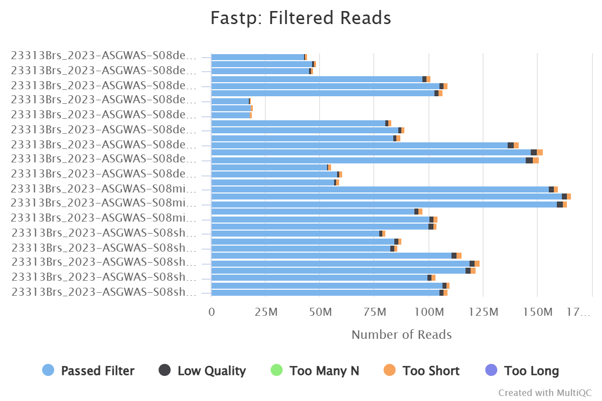
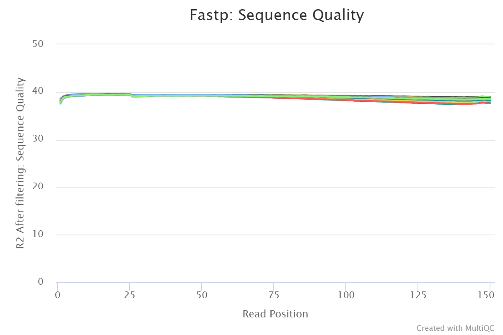

# *Montipora grisea* Host Genotyping Notebook  
Samples from Fagatele Bay collected in 2023  

## 2025-12-22  

Samples copied from Jason's folder of fastqs copied into my directory on the cluster.  

    [kpark049@turing1 fastqs]$ pwd
    /cm/shared/courses/dbarshis/barshislab/KatieP/taxons/Montipora_grisea/2023-Mgri-NMSAS/fastqs
    [kpark049@turing1 fastqs]$ ls
    23313Brs_2023-ASGWAS-S08deep-Mgri-01_R24069_R1.fastq.gz
    23313Brs_2023-ASGWAS-S08deep-Mgri-01_R24069_R2.fastq.gz
    23313Brs_2023-ASGWAS-S08deep-Mgri-01_R24073_R1.fastq.gz
    23313Brs_2023-ASGWAS-S08deep-Mgri-01_R24073_R2.fastq.gz
    23313Brs_2023-ASGWAS-S08deep-Mgri-01_R24074_R1.fastq.gz
    23313Brs_2023-ASGWAS-S08deep-Mgri-01_R24074_R2.fastq.gz
    23313Brs_2023-ASGWAS-S08deep-Mgri-02_R24069_R1.fastq.gz
    23313Brs_2023-ASGWAS-S08deep-Mgri-02_R24069_R2.fastq.gz
    23313Brs_2023-ASGWAS-S08deep-Mgri-02_R24073_R1.fastq.gz
    23313Brs_2023-ASGWAS-S08deep-Mgri-02_R24073_R2.fastq.gz
    23313Brs_2023-ASGWAS-S08deep-Mgri-02_R24074_R1.fastq.gz
    23313Brs_2023-ASGWAS-S08deep-Mgri-02_R24074_R2.fastq.gz
    23313Brs_2023-ASGWAS-S08deep-Mgri-03_R24069_R1.fastq.gz
    23313Brs_2023-ASGWAS-S08deep-Mgri-03_R24069_R2.fastq.gz
    23313Brs_2023-ASGWAS-S08deep-Mgri-03_R24073_R1.fastq.gz
    23313Brs_2023-ASGWAS-S08deep-Mgri-03_R24073_R2.fastq.gz
    23313Brs_2023-ASGWAS-S08deep-Mgri-03_R24074_R1.fastq.gz
    23313Brs_2023-ASGWAS-S08deep-Mgri-03_R24074_R2.fastq.gz
    23313Brs_2023-ASGWAS-S08deep-Mgri-04_R24069_R1.fastq.gz
    23313Brs_2023-ASGWAS-S08deep-Mgri-04_R24069_R2.fastq.gz
    23313Brs_2023-ASGWAS-S08deep-Mgri-04_R24073_R1.fastq.gz
    23313Brs_2023-ASGWAS-S08deep-Mgri-04_R24073_R2.fastq.gz
    23313Brs_2023-ASGWAS-S08deep-Mgri-04_R24074_R1.fastq.gz
    23313Brs_2023-ASGWAS-S08deep-Mgri-04_R24074_R2.fastq.gz
    23313Brs_2023-ASGWAS-S08deep-Mgri-05_R24069_R1.fastq.gz
    23313Brs_2023-ASGWAS-S08deep-Mgri-05_R24069_R2.fastq.gz
    23313Brs_2023-ASGWAS-S08deep-Mgri-05_R24073_R1.fastq.gz
    23313Brs_2023-ASGWAS-S08deep-Mgri-05_R24073_R2.fastq.gz
    23313Brs_2023-ASGWAS-S08deep-Mgri-05_R24074_R1.fastq.gz
    23313Brs_2023-ASGWAS-S08deep-Mgri-05_R24074_R2.fastq.gz
    23313Brs_2023-ASGWAS-S08deep-Mgri-07_R24069_R1.fastq.gz
    23313Brs_2023-ASGWAS-S08deep-Mgri-07_R24069_R2.fastq.gz
    23313Brs_2023-ASGWAS-S08deep-Mgri-07_R24073_R1.fastq.gz
    23313Brs_2023-ASGWAS-S08deep-Mgri-07_R24073_R2.fastq.gz
    23313Brs_2023-ASGWAS-S08deep-Mgri-07_R24074_R1.fastq.gz
    23313Brs_2023-ASGWAS-S08deep-Mgri-07_R24074_R2.fastq.gz
    23313Brs_2023-ASGWAS-S08midd-Mgri-02_R24069_R1.fastq.gz
    23313Brs_2023-ASGWAS-S08midd-Mgri-02_R24069_R2.fastq.gz
    23313Brs_2023-ASGWAS-S08midd-Mgri-02_R24073_R1.fastq.gz
    23313Brs_2023-ASGWAS-S08midd-Mgri-02_R24073_R2.fastq.gz
    23313Brs_2023-ASGWAS-S08midd-Mgri-02_R24074_R1.fastq.gz
    23313Brs_2023-ASGWAS-S08midd-Mgri-02_R24074_R2.fastq.gz
    23313Brs_2023-ASGWAS-S08midd-Mgri-05_R24069_R1.fastq.gz
    23313Brs_2023-ASGWAS-S08midd-Mgri-05_R24069_R2.fastq.gz
    23313Brs_2023-ASGWAS-S08midd-Mgri-05_R24073_R1.fastq.gz
    23313Brs_2023-ASGWAS-S08midd-Mgri-05_R24073_R2.fastq.gz
    23313Brs_2023-ASGWAS-S08midd-Mgri-05_R24074_R1.fastq.gz
    23313Brs_2023-ASGWAS-S08midd-Mgri-05_R24074_R2.fastq.gz
    23313Brs_2023-ASGWAS-S08shall-Mgri-01_R24069_R1.fastq.gz
    23313Brs_2023-ASGWAS-S08shall-Mgri-01_R24069_R2.fastq.gz
    23313Brs_2023-ASGWAS-S08shall-Mgri-01_R24073_R1.fastq.gz
    23313Brs_2023-ASGWAS-S08shall-Mgri-01_R24073_R2.fastq.gz
    23313Brs_2023-ASGWAS-S08shall-Mgri-01_R24074_R1.fastq.gz
    23313Brs_2023-ASGWAS-S08shall-Mgri-01_R24074_R2.fastq.gz
    23313Brs_2023-ASGWAS-S08shall-Mgri-02_R24069_R1.fastq.gz
    23313Brs_2023-ASGWAS-S08shall-Mgri-02_R24069_R2.fastq.gz
    23313Brs_2023-ASGWAS-S08shall-Mgri-02_R24073_R1.fastq.gz
    23313Brs_2023-ASGWAS-S08shall-Mgri-02_R24073_R2.fastq.gz
    23313Brs_2023-ASGWAS-S08shall-Mgri-02_R24074_R1.fastq.gz
    23313Brs_2023-ASGWAS-S08shall-Mgri-02_R24074_R2.fastq.gz
    23313Brs_2023-ASGWAS-S08shall-Mgri-06_R24069_R1.fastq.gz
    23313Brs_2023-ASGWAS-S08shall-Mgri-06_R24069_R2.fastq.gz
    23313Brs_2023-ASGWAS-S08shall-Mgri-06_R24073_R1.fastq.gz
    23313Brs_2023-ASGWAS-S08shall-Mgri-06_R24073_R2.fastq.gz
    23313Brs_2023-ASGWAS-S08shall-Mgri-06_R24074_R1.fastq.gz
    23313Brs_2023-ASGWAS-S08shall-Mgri-06_R24074_R2.fastq.gz  

**Check MD5SUM**  

	md5sum *.fastq.gz > MD5SUMS_23313Brs.txt
    
## 2025-12-23

**Check MD5SUM**  

    [kpark049@coreV3-23-027 fastqs]$ cut -d' ' -f1 MD5SUMS_23313Brs.txt > checksums.txt
    [kpark049@coreV3-23-027 fastqs]$ sort checksums.txt | uniq -d

All files are unique. 

    
	[kpark049@coreV3-23-027 fastqs]$ md5sum -c MD5SUMS_23313Brs.txt | tee md5checks.txt
    23313Brs_2023-ASGWAS-S08deep-Mgri-01_R24069_R1.fastq.gz: OK
    23313Brs_2023-ASGWAS-S08deep-Mgri-01_R24069_R2.fastq.gz: OK
    23313Brs_2023-ASGWAS-S08deep-Mgri-01_R24073_R1.fastq.gz: OK
    23313Brs_2023-ASGWAS-S08deep-Mgri-01_R24073_R2.fastq.gz: OK
    23313Brs_2023-ASGWAS-S08deep-Mgri-01_R24074_R1.fastq.gz: OK
    23313Brs_2023-ASGWAS-S08deep-Mgri-01_R24074_R2.fastq.gz: OK
    23313Brs_2023-ASGWAS-S08deep-Mgri-02_R24069_R1.fastq.gz: OK
    23313Brs_2023-ASGWAS-S08deep-Mgri-02_R24069_R2.fastq.gz: OK
    23313Brs_2023-ASGWAS-S08deep-Mgri-02_R24073_R1.fastq.gz: OK
    23313Brs_2023-ASGWAS-S08deep-Mgri-02_R24073_R2.fastq.gz: OK
    23313Brs_2023-ASGWAS-S08deep-Mgri-02_R24074_R1.fastq.gz: OK
    23313Brs_2023-ASGWAS-S08deep-Mgri-02_R24074_R2.fastq.gz: OK
    23313Brs_2023-ASGWAS-S08deep-Mgri-03_R24069_R1.fastq.gz: OK
    23313Brs_2023-ASGWAS-S08deep-Mgri-03_R24069_R2.fastq.gz: OK
    23313Brs_2023-ASGWAS-S08deep-Mgri-03_R24073_R1.fastq.gz: OK
    23313Brs_2023-ASGWAS-S08deep-Mgri-03_R24073_R2.fastq.gz: OK
    23313Brs_2023-ASGWAS-S08deep-Mgri-03_R24074_R1.fastq.gz: OK
    23313Brs_2023-ASGWAS-S08deep-Mgri-03_R24074_R2.fastq.gz: OK
    23313Brs_2023-ASGWAS-S08deep-Mgri-04_R24069_R1.fastq.gz: OK
    23313Brs_2023-ASGWAS-S08deep-Mgri-04_R24069_R2.fastq.gz: OK
    23313Brs_2023-ASGWAS-S08deep-Mgri-04_R24073_R1.fastq.gz: OK
    23313Brs_2023-ASGWAS-S08deep-Mgri-04_R24073_R2.fastq.gz: OK
    23313Brs_2023-ASGWAS-S08deep-Mgri-04_R24074_R1.fastq.gz: OK
    23313Brs_2023-ASGWAS-S08deep-Mgri-04_R24074_R2.fastq.gz: OK
    23313Brs_2023-ASGWAS-S08deep-Mgri-05_R24069_R1.fastq.gz: OK
    23313Brs_2023-ASGWAS-S08deep-Mgri-05_R24069_R2.fastq.gz: OK
    23313Brs_2023-ASGWAS-S08deep-Mgri-05_R24073_R1.fastq.gz: OK
    23313Brs_2023-ASGWAS-S08deep-Mgri-05_R24073_R2.fastq.gz: OK
    23313Brs_2023-ASGWAS-S08deep-Mgri-05_R24074_R1.fastq.gz: OK
    23313Brs_2023-ASGWAS-S08deep-Mgri-05_R24074_R2.fastq.gz: OK
    23313Brs_2023-ASGWAS-S08deep-Mgri-07_R24069_R1.fastq.gz: OK
    23313Brs_2023-ASGWAS-S08deep-Mgri-07_R24069_R2.fastq.gz: OK
    23313Brs_2023-ASGWAS-S08deep-Mgri-07_R24073_R1.fastq.gz: OK
    23313Brs_2023-ASGWAS-S08deep-Mgri-07_R24073_R2.fastq.gz: OK
    23313Brs_2023-ASGWAS-S08deep-Mgri-07_R24074_R1.fastq.gz: OK
    23313Brs_2023-ASGWAS-S08deep-Mgri-07_R24074_R2.fastq.gz: OK
    23313Brs_2023-ASGWAS-S08midd-Mgri-02_R24069_R1.fastq.gz: OK
    23313Brs_2023-ASGWAS-S08midd-Mgri-02_R24069_R2.fastq.gz: OK
    23313Brs_2023-ASGWAS-S08midd-Mgri-02_R24073_R1.fastq.gz: OK
    23313Brs_2023-ASGWAS-S08midd-Mgri-02_R24073_R2.fastq.gz: OK
    23313Brs_2023-ASGWAS-S08midd-Mgri-02_R24074_R1.fastq.gz: OK
    23313Brs_2023-ASGWAS-S08midd-Mgri-02_R24074_R2.fastq.gz: OK
    23313Brs_2023-ASGWAS-S08midd-Mgri-05_R24069_R1.fastq.gz: OK
    23313Brs_2023-ASGWAS-S08midd-Mgri-05_R24069_R2.fastq.gz: OK
    23313Brs_2023-ASGWAS-S08midd-Mgri-05_R24073_R1.fastq.gz: OK
    23313Brs_2023-ASGWAS-S08midd-Mgri-05_R24073_R2.fastq.gz: OK
    23313Brs_2023-ASGWAS-S08midd-Mgri-05_R24074_R1.fastq.gz: OK
    23313Brs_2023-ASGWAS-S08midd-Mgri-05_R24074_R2.fastq.gz: OK
    23313Brs_2023-ASGWAS-S08shall-Mgri-01_R24069_R1.fastq.gz: OK
    23313Brs_2023-ASGWAS-S08shall-Mgri-01_R24069_R2.fastq.gz: OK
    23313Brs_2023-ASGWAS-S08shall-Mgri-01_R24073_R1.fastq.gz: OK
    23313Brs_2023-ASGWAS-S08shall-Mgri-01_R24073_R2.fastq.gz: OK
    23313Brs_2023-ASGWAS-S08shall-Mgri-01_R24074_R1.fastq.gz: OK
    23313Brs_2023-ASGWAS-S08shall-Mgri-01_R24074_R2.fastq.gz: OK
    23313Brs_2023-ASGWAS-S08shall-Mgri-02_R24069_R1.fastq.gz: OK
    23313Brs_2023-ASGWAS-S08shall-Mgri-02_R24069_R2.fastq.gz: OK
    23313Brs_2023-ASGWAS-S08shall-Mgri-02_R24073_R1.fastq.gz: OK
    23313Brs_2023-ASGWAS-S08shall-Mgri-02_R24073_R2.fastq.gz: OK
    23313Brs_2023-ASGWAS-S08shall-Mgri-02_R24074_R1.fastq.gz: OK
    23313Brs_2023-ASGWAS-S08shall-Mgri-02_R24074_R2.fastq.gz: OK
    23313Brs_2023-ASGWAS-S08shall-Mgri-06_R24069_R1.fastq.gz: OK
    23313Brs_2023-ASGWAS-S08shall-Mgri-06_R24069_R2.fastq.gz: OK
    23313Brs_2023-ASGWAS-S08shall-Mgri-06_R24073_R1.fastq.gz: OK
    23313Brs_2023-ASGWAS-S08shall-Mgri-06_R24073_R2.fastq.gz: OK
    23313Brs_2023-ASGWAS-S08shall-Mgri-06_R24074_R1.fastq.gz: OK
    23313Brs_2023-ASGWAS-S08shall-Mgri-06_R24074_R2.fastq.gz: OK

Double check all files have been checked 

    [kpark049@coreV3-23-027 fastqs]$ ls *.fastq.gz | wc -l
    66
    [kpark049@coreV3-23-027 fastqs]$ wc -l md5checks.txt
    66 md5checks.txt

Files are good to go :)
___

**Trimming and QC**  

make name of all samples (unique file names after removing _R1 or _R2.fastq.gz)

    [kpark049@coreV3-23-027 fastqs]$ ls *.fastq.gz | sed -E 's/_R[12].fastq.gz//' | sort | uniq > sample_list.txt
   
    [kpark049@coreV3-23-027 fastqs]$ cat sample_list.txt
    23313Brs_2023-ASGWAS-S08deep-Mgri-01_R24069
    23313Brs_2023-ASGWAS-S08deep-Mgri-01_R24073
    23313Brs_2023-ASGWAS-S08deep-Mgri-01_R24074
    23313Brs_2023-ASGWAS-S08deep-Mgri-02_R24069
    23313Brs_2023-ASGWAS-S08deep-Mgri-02_R24073
    23313Brs_2023-ASGWAS-S08deep-Mgri-02_R24074
    23313Brs_2023-ASGWAS-S08deep-Mgri-03_R24069
    23313Brs_2023-ASGWAS-S08deep-Mgri-03_R24073
    23313Brs_2023-ASGWAS-S08deep-Mgri-03_R24074
    23313Brs_2023-ASGWAS-S08deep-Mgri-04_R24069
    23313Brs_2023-ASGWAS-S08deep-Mgri-04_R24073
    23313Brs_2023-ASGWAS-S08deep-Mgri-04_R24074
    23313Brs_2023-ASGWAS-S08deep-Mgri-05_R24069
    23313Brs_2023-ASGWAS-S08deep-Mgri-05_R24073
    23313Brs_2023-ASGWAS-S08deep-Mgri-05_R24074
    23313Brs_2023-ASGWAS-S08deep-Mgri-07_R24069
    23313Brs_2023-ASGWAS-S08deep-Mgri-07_R24073
    23313Brs_2023-ASGWAS-S08deep-Mgri-07_R24074
    23313Brs_2023-ASGWAS-S08midd-Mgri-02_R24069
    23313Brs_2023-ASGWAS-S08midd-Mgri-02_R24073
    23313Brs_2023-ASGWAS-S08midd-Mgri-02_R24074
    23313Brs_2023-ASGWAS-S08midd-Mgri-05_R24069
    23313Brs_2023-ASGWAS-S08midd-Mgri-05_R24073
    23313Brs_2023-ASGWAS-S08midd-Mgri-05_R24074
    23313Brs_2023-ASGWAS-S08shall-Mgri-01_R24069
    23313Brs_2023-ASGWAS-S08shall-Mgri-01_R24073
    23313Brs_2023-ASGWAS-S08shall-Mgri-01_R24074
    23313Brs_2023-ASGWAS-S08shall-Mgri-02_R24069
    23313Brs_2023-ASGWAS-S08shall-Mgri-02_R24073
    23313Brs_2023-ASGWAS-S08shall-Mgri-02_R24074
    23313Brs_2023-ASGWAS-S08shall-Mgri-06_R24069
    23313Brs_2023-ASGWAS-S08shall-Mgri-06_R24073
    23313Brs_2023-ASGWAS-S08shall-Mgri-06_R24074
    
    
made directories for organization and moved MD5Check outputs 

    fastp_reports
    fastp.slurm
    MD5Check
    sample_data
    trimmed_fastq

fastp sbatch script

    [kpark049@coreV3-23-027 fastqs]$ nano fastp.slurm

    #!/bin/bash -l

    #SBATCH --job-name=fastp_array_2025-12-23
    #SBATCH --output=%A_%a_%x.out
    #SBATCH --error=%A_%a_%x.err
    #SBATCH --mail-type=ALL
    #SBATCH --mail-user=kpark049@odu.edu
    #SBATCH --partition=main
    #SBATCH --array=1-66
    #SBATCH --ntasks=1
    #SBATCH --mem=30G
    #SBATCH --time=7-00:00:00

    ## Load modules
    module load container_env
    module load fastp

    ## Define some variables
    BASEDIR=/cm/shared/courses/dbarshis/barshislab/KatieP/taxons/Montipora_grisea/2023-Mgri-NMSAS/
    RAWDATA=$BASEDIR/fastqs #path to raw fq.gz files
    OUTDIR=$BASEDIR/fastqs/trimmed_fastq
    SAMPLELIST=$BASEDIR/fastqs/sample_data/sample_list.txt # Path to a list of prefixes of the raw fastq files. It can be a subset of the the 1st column of the sample table (without the header line).
    SAMPLETABLE=$BASEDIR/fastqs/sample_data/sample_table.txt # Path to a sample table where the 1st column is the prefix of the raw fastq files. The 4th column is the sample ID, the 2nd column is the lane number, and the 3rd column is sequence ID. The combination of these three columns have to be unique. The 6th column should be data type, which is either pe or se.
    RAW_R1=_R1.fastq.gz # Suffix to raw fastq files. Use forward reads with paired-end data.
    RAW_R2=_R2.fastq.gz # Suffix to raw fastq files. Use reverse reads with paired-end data.

    ## Keep a record of the Job ID
    echo $SLURM_JOB_ID

    ## Select the SAMPLE from the SAMPLELIST
    SAMPLEFILE=`head $SAMPLELIST -n $SLURM_ARRAY_TASK_ID | tail -n 1`

    ## Keep record of sample file
    echo $SAMPLEFILE

    ## Extract relevant values from a table of sample, sequencing, and lane ID (here in columns 4, 3, 2, respectively) for each sequenced library. This is for the naming of trimmed/processed files
    SAMPLE_ID=`grep -P "${SAMPLEFILE}\t" $SAMPLETABLE | cut -f 4`
    POP_ID=`grep -P "${SAMPLEFILE}\t" $SAMPLETABLE | cut -f 5`
    SEQ_ID=`grep -P "${SAMPLEFILE}\t" $SAMPLETABLE | cut -f 3`
    LANE_ID=`grep -P "${SAMPLEFILE}\t" $SAMPLETABLE | cut -f 2`
    PREP_ID=`grep -P "${SAMPLEFILE}\t" $SAMPLETABLE | cut -f 13`
    SAMPLE_UNIQ_ID=$SAMPLE_ID'_'$SEQ_ID'_'$PREP_ID'_'$LANE_ID  # When a sample has been sequenced in multiple lanes, we need to be able to identify the files from each run uniquely

    echo $SAMPLE_UNIQ_ID

    ## Define the output path and file prefix
    SAMPLETRIM=$OUTDIR/$SAMPLE_UNIQ_ID

    ## Run fastp
    crun.fastp fastp -i $RAWDATA/$SAMPLEFILE$RAW_R1 \
        -I $RAWDATA/$SAMPLEFILE$RAW_R2 \
        -o ${SAMPLETRIM}_f_paired_trim.fastq.gz \
        -O ${SAMPLETRIM}_r_paired_trim.fastq.gz \
        --adapter_fasta /archive/barshis/barshislab/jtoy/pver_gwas/pver_gwas_batch3/adapters.fa \
        --cut_tail \
        --trim_poly_g \
        -l 40 \
        -h $BASEDIR/fastqs/fastp_reports/${SAMPLE_UNIQ_ID}_fastp.html \
        -j $BASEDIR/fastqs/fastp_reports/${SAMPLE_UNIQ_ID}_fastp.json \
        --thread 16

Made sample_table.txt in Excel then pasted to cluster

	[kpark049@coreV3-23-027 sample_data]$ head sample_table.txt 
    23313Brs_2023-ASGWAS-S08deep-Mgri-01_R24069_R1  R24069  1       S08deep-Mgri-01    pe
    23313Brs_2023-ASGWAS-S08deep-Mgri-01_R24069_R2  R24069  1       S08deep-Mgri-01    pe
    23313Brs_2023-ASGWAS-S08deep-Mgri-01_R24073_R1  R24073  1       S08deep-Mgri-01    pe
    23313Brs_2023-ASGWAS-S08deep-Mgri-01_R24073_R2  R24073  1       S08deep-Mgri-01    pe
    23313Brs_2023-ASGWAS-S08deep-Mgri-01_R24074_R1  R24074  1       S08deep-Mgri-01    pe
    23313Brs_2023-ASGWAS-S08deep-Mgri-01_R24074_R2  R24074  1       S08deep-Mgri-01    pe
    23313Brs_2023-ASGWAS-S08deep-Mgri-02_R24069_R1  R24069  1       S08deep-Mgri-02    pe
    23313Brs_2023-ASGWAS-S08deep-Mgri-02_R24069_R2  R24069  1       S08deep-Mgri-02    pe
    23313Brs_2023-ASGWAS-S08deep-Mgri-02_R24073_R1  R24073  1       S08deep-Mgri-02    pe
    23313Brs_2023-ASGWAS-S08deep-Mgri-02_R24073_R2  R24073  1       S08deep-Mgri-02    pe

Adapters from Jason's directory: 

    [kpark049@coreV3-23-027 pver_gwas_batch3]$ pwd
    /archive/barshis/barshislab/jtoy/pver_gwas/pver_gwas_batch3

    [kpark049@coreV3-23-027 pver_gwas_batch3]$ cat adapters.fa
    >Illumina TruSeq Adapter Read 1
    AGATCGGAAGAGCACACGTCTGAACTCCAGTCA
    >Illumina TruSeq Adapter Read 2
    AGATCGGAAGAGCGTCGTGTAGGGAAAGAGTGT
    >index i7a
    GATCGGAAGAGCACACGTCTGAACTCCAGTCAC
    >index i7b
    ATCTCGTATGCCGTCTTCTGCTTG
    >index i5a
    AATGATACGGCGACCACCGAGATCTACAC
    >index i5b
    ACACTCTTTCCCTACACGACGCTCTTCCGATCT

Submitted Job ~ 4:30PM Central Time

    [kpark049@coreV3-23-027 fastqs]$ sbatch fastp.slurm 
    Submitted batch job 10784309

## 2026-01-02
**Output from running the fastp.slurm**

    [kpark049@coreV3-23-027 fastqs]$ pwd
    /cm/shared/courses/dbarshis/barshislab/KatieP/taxons/Montipora_grisea/2023-Mgri-NMSAS/fastqs
    [kpark049@coreV3-23-027 fastqs]$ ls
    10784309_10_fastp_array_2025-12-23.err  10784309_57_fastp_array_2025-12-23.err
    10784309_10_fastp_array_2025-12-23.out  10784309_57_fastp_array_2025-12-23.out
    10784309_11_fastp_array_2025-12-23.err  10784309_58_fastp_array_2025-12-23.err
    10784309_11_fastp_array_2025-12-23.out  10784309_58_fastp_array_2025-12-23.out
    10784309_12_fastp_array_2025-12-23.err  10784309_59_fastp_array_2025-12-23.err
    10784309_12_fastp_array_2025-12-23.out  10784309_59_fastp_array_2025-12-23.out
    10784309_13_fastp_array_2025-12-23.err  10784309_5_fastp_array_2025-12-23.err
    10784309_13_fastp_array_2025-12-23.out  10784309_5_fastp_array_2025-12-23.out
    10784309_14_fastp_array_2025-12-23.err  10784309_60_fastp_array_2025-12-23.err
    10784309_14_fastp_array_2025-12-23.out  10784309_60_fastp_array_2025-12-23.out
    10784309_15_fastp_array_2025-12-23.err  10784309_61_fastp_array_2025-12-23.err
    10784309_15_fastp_array_2025-12-23.out  10784309_61_fastp_array_2025-12-23.out
    10784309_16_fastp_array_2025-12-23.err  10784309_62_fastp_array_2025-12-23.err
    10784309_16_fastp_array_2025-12-23.out  10784309_62_fastp_array_2025-12-23.out
    10784309_17_fastp_array_2025-12-23.err  10784309_63_fastp_array_2025-12-23.err
    10784309_17_fastp_array_2025-12-23.out  10784309_63_fastp_array_2025-12-23.out
    10784309_18_fastp_array_2025-12-23.err  10784309_64_fastp_array_2025-12-23.err
    10784309_18_fastp_array_2025-12-23.out  10784309_64_fastp_array_2025-12-23.out
    10784309_19_fastp_array_2025-12-23.err  10784309_65_fastp_array_2025-12-23.err
    10784309_19_fastp_array_2025-12-23.out  10784309_65_fastp_array_2025-12-23.out
    10784309_1_fastp_array_2025-12-23.err   10784309_66_fastp_array_2025-12-23.err
    10784309_1_fastp_array_2025-12-23.out   10784309_66_fastp_array_2025-12-23.out
    10784309_20_fastp_array_2025-12-23.err  10784309_6_fastp_array_2025-12-23.err
    10784309_20_fastp_array_2025-12-23.out  10784309_6_fastp_array_2025-12-23.out
    10784309_21_fastp_array_2025-12-23.err  10784309_7_fastp_array_2025-12-23.err
    10784309_21_fastp_array_2025-12-23.out  10784309_7_fastp_array_2025-12-23.out
    10784309_22_fastp_array_2025-12-23.err  10784309_8_fastp_array_2025-12-23.err
    10784309_22_fastp_array_2025-12-23.out  10784309_8_fastp_array_2025-12-23.out
    10784309_23_fastp_array_2025-12-23.err  10784309_9_fastp_array_2025-12-23.err
    10784309_23_fastp_array_2025-12-23.out  10784309_9_fastp_array_2025-12-23.out
    10784309_24_fastp_array_2025-12-23.err  23313Brs_2023-ASGWAS-S08deep-Mgri-01_R24069_R1.fastq.gz
    10784309_24_fastp_array_2025-12-23.out  23313Brs_2023-ASGWAS-S08deep-Mgri-01_R24069_R2.fastq.gz
    10784309_25_fastp_array_2025-12-23.err  23313Brs_2023-ASGWAS-S08deep-Mgri-01_R24073_R1.fastq.gz
    10784309_25_fastp_array_2025-12-23.out  23313Brs_2023-ASGWAS-S08deep-Mgri-01_R24073_R2.fastq.gz
    10784309_26_fastp_array_2025-12-23.err  23313Brs_2023-ASGWAS-S08deep-Mgri-01_R24074_R1.fastq.gz
    10784309_26_fastp_array_2025-12-23.out  23313Brs_2023-ASGWAS-S08deep-Mgri-01_R24074_R2.fastq.gz
    ...
    [kpark049@coreV3-23-027 fastp_reports]$ pwd
    /cm/shared/courses/dbarshis/barshislab/KatieP/taxons/Montipora_grisea/2023-Mgri-NMSAS/fastqs/fastp_reports
    [kpark049@coreV3-23-027 fastp_reports]$ ls
    ____fastp.html  ____fastp.json

Issue with output naming. 

**Recap of what I did and output:**

The sample_list.txt file was generated by stripping _R1/_R2.fastq.gz from filenames, producing one prefix per FASTQ pair. Validation confirmed that every prefix in sample_list.txt has both corresponding R1 and R2 files present, so the input FASTQs and array-based fastp strategy are correct.

fastp jobs successfully launched via a SLURM array, but output report files were named ____fastp.html/json, indicating that the variable used to construct unique output names (SAMPLE_UNIQ_ID) was empty. This traced back to a failure when extracting metadata from sample_table.txt.

Specifically, the FASTQ prefixes in sample_list.txt did not match exactly with the identifiers in column 1 of sample_table.txt (or the table delimiter differed), causing all grep lookups to return no matches. As a result, sample, lane, run, and prep IDs were not populated, breaking downstream file naming even though fastp itself ran.

Conclusion:
The trimming step itself executed correctly and input data are intact. The remaining issue is a string-matching / formatting mismatch between FASTQ prefixes and the sample metadata table, not a problem with WGS handling, file presence, or fastp parameters.

**Moved previous output to new directory**

    [kpark049@coreV3-23-027 2025-12-23_failed_fastp_run_output]$ pwd
    /cm/shared/courses/dbarshis/barshislab/KatieP/taxons/Montipora_grisea/2023-Mgri-NMSAS/fastqs/2025-12-23_failed_fastp_run_output
    kpark049@coreV3-23-027 2025-12-23_failed_fastp_run_output]$ls 
     2025-12-23_fastp.slurm
    10784309_2_fastp_array_2025-12-23.out   10784309_50_fastp_array_2025-12-23.err
    *all other .out and .err files
      fastp_reports
      trimmed_fastq

**updated fastp.slurm to correct file output naming issue**

    [kpark049@coreV3-23-027 fastqs]$ cat fastp.slurm
    #!/bin/bash -l

    #SBATCH --job-name=fastp_array_2026-01-02
    #SBATCH --output=%A_%a_%x.out
    #SBATCH --error=%A_%a_%x.err
    #SBATCH --mail-type=ALL
    #SBATCH --mail-user=kpark049@odu.edu
    #SBATCH --partition=main
    #SBATCH --array=1-66
    #SBATCH --ntasks=1
    #SBATCH --mem=30G
    #SBATCH --time=7-00:00:00

    ## Load modules
    module load container_env
    module load fastp

    ## Define some variables
    BASEDIR=/cm/shared/courses/dbarshis/barshislab/KatieP/taxons/Montipora_grisea/2023-Mgri-NMSAS/
    RAWDATA=$BASEDIR/fastqs
    OUTDIR=$BASEDIR/fastqs/trimmed_fastqs
    SAMPLELIST=$BASEDIR/fastqs/sample_data/sample_list.txt
    RAW_R1=_R1.fastq.gz
    RAW_R2=_R2.fastq.gz

    ## Keep a record of the Job ID
    echo $SLURM_JOB_ID

    ## Select the SAMPLE from the SAMPLELIST
    SAMPLEFILE=`head $SAMPLELIST -n $SLURM_ARRAY_TASK_ID | tail -n 1`
    echo $SAMPLEFILE

    ## Define the output path and file prefix using the FASTQ prefix for uniqueness
    SAMPLE_UNIQ_ID=$SAMPLEFILE
    SAMPLETRIM=$OUTDIR/$SAMPLE_UNIQ_ID

    ## Run fastp
    crun.fastp fastp \
        -i $RAWDATA/${SAMPLEFILE}_R1.fastq.gz \
        -I $RAWDATA/${SAMPLEFILE}_R2.fastq.gz \
        -o ${SAMPLETRIM}_R1_trimmed.fastq.gz \
        -O ${SAMPLETRIM}_R2_trimmed.fastq.gz \
        --adapter_fasta /archive/barshis/barshislab/jtoy/pver_gwas/pver_gwas_batch3/adapters.fa \
        --cut_tail \
        --trim_poly_g \
        -l 40 \
        -h $BASEDIR/fastqs/fastp_reports/${SAMPLE_UNIQ_ID}_fastp.html \
        -j $BASEDIR/fastqs/fastp_reports/${SAMPLE_UNIQ_ID}_fastp.json \
        --thread 16

**make sure direcotry running script looks like this (ie trimmed_fastqs and fastp_reports directory for script output)

    [kpark049@coreV3-23-027 fastqs]$ pwd
    /cm/shared/courses/dbarshis/barshislab/KatieP/taxons/Montipora_grisea/2023-Mgri-NMSAS/fastqs

	*all fastq.gz files to trim*
     fastp_reports
     fastp.slurm
     MD5Check
     sample_data
     trimmed_fastqs

Started job at 1:27PM on 2026-01-02

    [kpark049@coreV3-23-040 fastqs]$ sbatch fastp.slurm
    Submitted batch job 10784730

## 2025-01-06: Confirming Fastp and MultiQC
Fastp worked

    
    
    [kpark049@turing1 trimmed_fastqs]$ pwd
    /cm/shared/courses/dbarshis/barshislab/KatieP/taxons/Montipora_grisea/2023-Mgri-NMSAS/fastqs/trimmed_fastqs
    
    [kpark049@turing1 fastp_reports] ls -U | head -10
    23313Brs_2023-ASGWAS-S08deep-Mgri-02_R24074_R2_trimmed.fastq.gz
    23313Brs_2023-ASGWAS-S08midd-Mgri-02_R24074_R2_trimmed.fastq.gz
    23313Brs_2023-ASGWAS-S08deep-Mgri-01_R24073_R1_trimmed.fastq.gz
    23313Brs_2023-ASGWAS-S08deep-Mgri-03_R24074_R1_trimmed.fastq.gz
    23313Brs_2023-ASGWAS-S08deep-Mgri-01_R24069_R2_trimmed.fastq.gz
    23313Brs_2023-ASGWAS-S08deep-Mgri-03_R24069_R1_trimmed.fastq.gz
    23313Brs_2023-ASGWAS-S08deep-Mgri-04_R24069_R1_trimmed.fastq.gz
    23313Brs_2023-ASGWAS-S08deep-Mgri-07_R24073_R2_trimmed.fastq.gz
    23313Brs_2023-ASGWAS-S08shall-Mgri-06_R24069_R2_trimmed.fastq.gz
    23313Brs_2023-ASGWAS-S08deep-Mgri-05_R24074_R2_trimmed.fastq.gz

    kpark049@turing1 fastp_reports]$ pwd
    /cm/shared/courses/dbarshis/barshislab/KatieP/taxons/Montipora_grisea/2023-Mgri-NMSAS/fastqs/fastp_reports
    [kpark049@turing1 fastp_reports]$ ls -U | head -10
    23313Brs_2023-ASGWAS-S08midd-Mgri-02_R24069_fastp.json
    23313Brs_2023-ASGWAS-S08shall-Mgri-01_R24073_fastp.html
    23313Brs_2023-ASGWAS-S08midd-Mgri-05_R24069_fastp.json
    23313Brs_2023-ASGWAS-S08shall-Mgri-06_R24073_fastp.json
    23313Brs_2023-ASGWAS-S08deep-Mgri-07_R24074_fastp.json
    23313Brs_2023-ASGWAS-S08deep-Mgri-07_R24073_fastp.html
    23313Brs_2023-ASGWAS-S08deep-Mgri-01_R24074_fastp.html
    23313Brs_2023-ASGWAS-S08deep-Mgri-07_R24074_fastp.html
    23313Brs_2023-ASGWAS-S08midd-Mgri-05_R24074_fastp.html
    23313Brs_2023-ASGWAS-S08deep-Mgri-05_R24074_fastp.html
    
    [kpark049@turing1 fastp_reports]$ ls *.json | wc -l
    33
    
    [kpark049@turing1 fastp_reports]$ ls *.html | wc -l
    33

**Running MultiQC**

    [kpark049@turing1 fastp_reports]$ pwd
    /cm/shared/courses/dbarshis/barshislab/KatieP/taxons/Montipora_grisea/2023-Mgri-NMSAS/fastqs/fastp_reports
    
    [kpark049@turing1 fastp_reports]$ salloc
    salloc: Pending job allocation 10785002
    salloc: job 10785002 queued and waiting for resources
    salloc: job 10785002 has been allocated resources
    salloc: Granted job allocation 10785002
    salloc: Nodes coreV3-23-027 are ready for job
    
    [kpark049@coreV3-23-027 fastp_reports]$ module load container_env
    
    [kpark049@coreV3-23-027 fastp_reports]$ module load multiqc/1.13
   
    [kpark049@coreV3-23-027 fastp_reports]$ crun.multiqc multiqc --interactive --filename 2026-01-06_multiqc_report .
     /// MultiQC 🔍 | v1.13
    |           multiqc | MultiQC Version v1.33 now available!
    |           multiqc | Search path : /cm/shared/courses/dbarshis/barshislab/KatieP/taxons/Montipora_grisea/2023-Mgri-NMSAS/fastqs/fastp_reports
    |         searching | ━━━━━━━━━━━━━━━━━━━━━━━━━━━━━━━━━━━━━━━━ 100% 198/198
    |             fastp | Found 33 reports
    |           multiqc | Compressing plot data
    |           multiqc | Report      : 2026-01-06_multiqc_report.html
    |           multiqc | Data        : 2026-01-06_multiqc_report_data
    |           multiqc | MultiQC complete

Copy MultiQC report locally 

    kpark@KatiesPC MINGW64 ~/OneDrive/Documents/Barshis_Lab/Field_Work/2023-March-April_American-Samoa/data/Sequencing (main)
    $ pwd
    /c/Users/kpark/OneDrive/Documents/Barshis_Lab/Field_Work/2023-March-April_American-Samoa/data/Sequencing
    
    kpark@KatiesPC MINGW64 ~/OneDrive/Documents/Barshis_Lab/Field_Work/2023-March-April_American-Samoa/data/Sequencing (main)
    $ scp kpark049@turing.hpc.odu.edu:/cm/shared/courses/dbarshis/barshislab/KatieP/taxons/Montipora_grisea/2023-Mgri-NMSAS/fastqs/fastp_reports/2026-01-06_multiqc_report.html ./
    (kpark049@turing.hpc.odu.edu) Password:
    (kpark049@turing.hpc.odu.edu) Duo two-factor login for kpark049

    Enter a passcode or select one of the following options:

     1. Duo Push to XXX-XXX-6957
     2. SMS passcodes to XXX-XXX-6957 (next code starts with: 2)

    Passcode or option (1-2): 1
    Success. Logging you in...
    2026-01-06_multiqc_report.html 

Samples look good overall! 

| Sample Name | % Duplication | GC content | % PF | % Adapter |
|-------------|---------------|------------|------|-----------|
| 23313Brs_2023-ASGWAS-S08midd-Mgri-02_R24069_R1 | 22.7% | 43.7% | 97.4% | 17.2% |
| 23313Brs_2023-ASGWAS-S08midd-Mgri-02_R24074_R1 | 20.9% | 43.8% | 97.4% | 18.4% |
| 23313Brs_2023-ASGWAS-S08midd-Mgri-02_R24073_R1 | 20.6% | 43.8% | 97.4% | 18.5% |
| 23313Brs_2023-ASGWAS-S08deep-Mgri-02_R24069_R1 | 18.9% | 46.9% | 96.5% | 28.0% |
| 23313Brs_2023-ASGWAS-S08deep-Mgri-04_R24069_R1 | 19.5% | 42.1% | 96.8% | 28.4% |
| 23313Brs_2023-ASGWAS-S08deep-Mgri-03_R24069_R1 | 34.1% | 24.7% | 95.4% | 28.9% |
| 23313Brs_2023-ASGWAS-S08deep-Mgri-02_R24073_R1 | 17.3% | 47.1% | 96.6% | 29.5% |
| 23313Brs_2023-ASGWAS-S08deep-Mgri-02_R24074_R1 | 17.4% | 47.1% | 96.4% | 29.6% |
| 23313Brs_2023-ASGWAS-S08deep-Mgri-04_R24073_R1 | 17.6% | 42.3% | 96.8% | 30.3% |
| 23313Brs_2023-ASGWAS-S08deep-Mgri-04_R24074_R1 | 17.7% | 42.4% | 96.6% | 30.3% |
| 23313Brs_2023-ASGWAS-S08shall-Mgri-06_R24069_R1 | 19.2% | 43.2% | 96.8% | 30.7% |
| 23313Brs_2023-ASGWAS-S08deep-Mgri-03_R24073_R1 | 30.7% | 25.0% | 95.1% | 30.8% |
| 23313Brs_2023-ASGWAS-S08shall-Mgri-02_R24069_R1 | 17.9% | 43.5% | 96.2% | 31.3% |
| 23313Brs_2023-ASGWAS-S08deep-Mgri-03_R24074_R1 | 29.9% | 25.7% | 94.9% | 31.5% |
| 23313Brs_2023-ASGWAS-S08shall-Mgri-06_R24074_R1 | 17.8% | 43.3% | 96.7% | 32.6% |
| 23313Brs_2023-ASGWAS-S08midd-Mgri-05_R24069_R1 | 18.9% | 46.3% | 96.5% | 32.7% |
| 23313Brs_2023-ASGWAS-S08shall-Mgri-06_R24073_R1 | 17.4% | 43.3% | 96.8% | 32.7% |
| 23313Brs_2023-ASGWAS-S08deep-Mgri-01_R24069_R1 | 19.7% | 39.8% | 96.0% | 32.8% |
| 23313Brs_2023-ASGWAS-S08deep-Mgri-05_R24069_R1 | 18.1% | 47.7% | 96.3% | 32.8% |
| 23313Brs_2023-ASGWAS-S08shall-Mgri-02_R24074_R1 | 16.7% | 43.7% | 96.1% | 33.1% |
| 23313Brs_2023-ASGWAS-S08shall-Mgri-02_R24073_R1 | 16.3% | 43.7% | 96.2% | 33.2% |
| 23313Brs_2023-ASGWAS-S08deep-Mgri-05_R24073_R1 | 16.8% | 47.9% | 96.3% | 34.3% |
| 23313Brs_2023-ASGWAS-S08deep-Mgri-05_R24074_R1 | 17.0% | 47.9% | 96.2% | 34.4% |
| 23313Brs_2023-ASGWAS-S08midd-Mgri-05_R24074_R1 | 17.7% | 46.5% | 96.4% | 34.5% |
| 23313Brs_2023-ASGWAS-S08midd-Mgri-05_R24073_R1 | 17.3% | 46.5% | 96.5% | 34.7% |
| 23313Brs_2023-ASGWAS-S08deep-Mgri-01_R24074_R1 | 17.8% | 40.3% | 95.8% | 34.8% |
| 23313Brs_2023-ASGWAS-S08deep-Mgri-01_R24073_R1 | 17.8% | 40.1% | 96.0% | 34.9% |
| 23313Brs_2023-ASGWAS-S08shall-Mgri-01_R24069_R1 | 15.5% | 42.9% | 96.5% | 39.3% |
| 23313Brs_2023-ASGWAS-S08deep-Mgri-07_R24069_R1 | 16.7% | 42.7% | 96.3% | 40.4% |
| 23313Brs_2023-ASGWAS-S08shall-Mgri-01_R24074_R1 | 14.6% | 43.1% | 96.3% | 41.2% |
| 23313Brs_2023-ASGWAS-S08shall-Mgri-01_R24073_R1 | 14.2% | 43.1% | 96.4% | 41.4% |
| 23313Brs_2023-ASGWAS-S08deep-Mgri-07_R24073_R1 | 15.2% | 42.9% | 96.2% | 42.4% |
| 23313Brs_2023-ASGWAS-S08deep-Mgri-07_R24074_R1 | 15.3% | 42.9% | 96.1% | 42.4% |

## 2026-02-06: Map reads to hologenome
Copy genome to my directory 

    [kpark049@coreV3-23-027 2022-12_WildGenomesMgrisGenome]$ pwd
    /RC/group/rc_barshis_lab/taxonarchive/Montipora_grisea/2022-12_WildGenomesMgrisGenome
    
    [kpark049@coreV3-23-027 2022-12_WildGenomesMgrisGenome]$ cp full_genome_scaffolds_Mgri_0.1.fasta /cm/shared/courses/dbarshis/barshislab/KatieP/taxons/Montipora_grisea/2023-Mgri-NMSAS/
    
    [kpark049@coreV3-23-027 /]$ cd /cm/shared/courses/dbarshis/barshislab/KatieP/taxons/Montipora_grisea/2023-Mgri-NMSAS/
    
    [kpark049@coreV3-23-027 2023-Mgri-NMSAS]$ ls
    fastqs  full_genome_scaffolds_Mgri_0.1.fasta
    
    [kpark049@coreV3-23-027 2023-Mgri-NMSAS]$ mkdir mgris_genome
    
    [kpark049@coreV3-23-027 2023-Mgri-NMSAS]$ mv full_genome_scaffolds_Mgri_0.1.fasta mgris_genome/
    
    [kpark049@coreV3-23-027 2023-Mgri-NMSAS]$ ls
    fastqs  mgris_genome
    
index genome

    [kpark049@coreV3-23-027 mgris_genome]$ pwd
    /cm/shared/courses/dbarshis/barshislab/KatieP/taxons/Montipora_grisea/2023-Mgri-NMSAS/mgris_genome
    
    [kpark049@coreV3-23-027 mgris_genome]$ ls
    full_genome_scaffolds_Mgri_0.1.fasta
    
    [kpark049@coreV3-23-027 mgris_genome]$ module load bowtie2

    [kpark049@coreV3-23-027 mgris_genome]$ crun.bowtie2 bowtie2-build full_genome_scaffolds_Mgri_0.1.fasta full_genome_scaffolds_Mgri_0.1
    Settings:
      Output files: "full_genome_scaffolds_Mgri_0.1.*.bt2"
      Line rate: 6 (line is 64 bytes)
      Lines per side: 1 (side is 64 bytes)
      Offset rate: 4 (one in 16)
      ...
      
    [kpark049@turing1 mgris_genome]$ ls
    full_genome_scaffolds_Mgri_0.1.1.bt2  full_genome_scaffolds_Mgri_0.1.fasta
    full_genome_scaffolds_Mgri_0.1.2.bt2  full_genome_scaffolds_Mgri_0.1.rev.1.bt2
    full_genome_scaffolds_Mgri_0.1.3.bt2  full_genome_scaffolds_Mgri_0.1.rev.2.bt2
    full_genome_scaffolds_Mgri_0.1.4.bt2

Now ready to run Bowtie2 

## 2026-01-07: Running BowTie2
Making a scripts folder to try and keep things organized 

    [kpark049@turing1 2023-Mgri-NMSAS]$ mkdir scripts
    
    [kpark049@turing1 2023-Mgri-NMSAS]$ ls
    bam  fastqs  mgris_genome  scripts
    
    [kpark049@turing1 2023-Mgri-NMSAS]$ cd scripts/

2026-01-07_bowtie2_mapping.slurm

    [kpark049@turing1 scripts]$ nano 2026-01-07_bowtie2_mapping.slurm
    
    #!/bin/bash -l

    #SBATCH --job-name=hologenome_mapping_2026-01-06
    #SBATCH --output=%A_%a_%x.out
    #SBATCH --error=%A_%a_%x.err
    #SBATCH --mail-type=ALL
    #SBATCH --mail-user=kpark049@odu.edu
    #SBATCH --partition=main
    #SBATCH --array=1-33      # One array task per sample
    #SBATCH --ntasks=1
    #SBATCH --mem=30G
    #SBATCH --time=7-00:00:00

    ## Load modules
    module load container_env
    module load bowtie2

    ## Define directories and files
    BASEDIR=/cm/shared/courses/dbarshis/barshislab/KatieP/taxons/Montipora_grisea/2023-Mgri-NMSAS
    FASTQDIR=$BASEDIR/fastqs/trimmed_fastqs           # path to trimmed fastq.gz files
    OUTDIR=$BASEDIR/bam                                # output directory for BAM files
    SAMPLELIST=$BASEDIR/fastqs/sample_data/sample_list.txt    # list of sample prefixes

    ## Keep a record of the SLURM job
    echo "SLURM_JOB_ID: $SLURM_JOB_ID"

    ## Select the sample for this array task
    SAMPLEFILE=$(head -n $SLURM_ARRAY_TASK_ID $SAMPLELIST | tail -n 1)
    echo "Processing sample: $SAMPLEFILE"

    ## Define output BAM prefix
    SAMPLEOUT=$OUTDIR/$SAMPLEFILE

    ## Run Bowtie2 mapping (paired-end)
    crun.bowtie2 bowtie2 -q --phred33 --very-sensitive -p 16 \
        -I 0 -X 1500 --fr \
        -x $BASEDIR/mgris_genome/full_genome_scaffolds_Mgri_0.1 \
        -1 $FASTQDIR/${SAMPLEFILE}_R1_trimmed.fastq.gz \
        -2 $FASTQDIR/${SAMPLEFILE}_R2_trimmed.fastq.gz \
        -S $SAMPLEOUT.sam

    # Unload Bowtie2, load GATK
    module unload bowtie2
    module load gatk

    GATK='crun.gatk gatk'

    # Sort by queryname
    $GATK --java-options "-Xmx30G" SortSam \
      --INPUT $SAMPLEOUT.sam \
      --OUTPUT $SAMPLEOUT.qsorted.bam \
      --SORT_ORDER queryname

    # Remove SAM to save space
    rm $SAMPLEOUT.sam

    # Mark duplicates and remove them
    $GATK --java-options "-Xmx30G" MarkDuplicates \
      -I $SAMPLEOUT.qsorted.bam \
      -O $SAMPLEOUT.qsorted_dedup.bam \
      --REMOVE_DUPLICATES true \
      --METRICS_FILE $SAMPLEOUT.dupmetrics.txt

    # Sort by coordinate for downstream analysis
    $GATK --java-options "-Xmx30G" SortSam \
      --INPUT $SAMPLEOUT.qsorted_dedup.bam \
      --OUTPUT $SAMPLEOUT.qsorted_dedup_coordsorted.bam \
      --SORT_ORDER coordinate

    # Cleanup intermediate files
    rm $SAMPLEOUT.qsorted.bam $SAMPLEOUT.qsorted_dedup.bam

    # Optional: validate final BAM
    $GATK --java-options "-Xmx30G" ValidateSamFile \
      -I $SAMPLEOUT.qsorted_dedup_coordsorted.bam \
      -O $SAMPLEOUT.val.txt \
      -M VERBOSE

    echo "Finished processing $SAMPLEFILE"

    [kpark049@turing1 scripts]$ salloc
    salloc: Pending job allocation 10785186
    salloc: job 10785186 queued and waiting for resources
    salloc: job 10785186 has been allocated resources
    salloc: Granted job allocation 10785186
    salloc: Nodes coreV3-23-027 are ready for job
    
    [kpark049@coreV3-23-027 scripts]$ sbatch 2026-01-07_bowtie2_mapping.slurm
    Submitted batch job 10785187

Submitted 01-07-2026 @ 9:40PM

## 2026-01-08: Bowtie2 Re-do

**First attempt did not work**
Based on .err output, Bowtie2 worked correctly, but then I ran into errors with GATK commands 

- Bowtie2 ran successfully (got a full alignment summary).
- GATK failed immediately due to a container / Java POSIX library issue.
- Because of that:
	- no BAMs were created
	- script still tried to rm files that never existed
	- ended up with an empty bam/ directory

Switching to samtools to avoid future Java POSIX library issues on hpc 

[kpark049@coreV4-21-k80-001 scripts]$ nano 2026-01-08_bowtie2_samtools.slurm
    #!/bin/bash -l

    #SBATCH --job-name=hologenome_mapping
    #SBATCH --output=%A_%a_%x.out
    #SBATCH --error=%A_%a_%x.err
    #SBATCH --mail-user=kpark049@odu.edu
    #SBATCH --partition=main
    #SBATCH --array=1-33
    #SBATCH --ntasks=1
    #SBATCH --cpus-per-task=16
    #SBATCH --mem=30G
    #SBATCH --time=3-00:00:00

    module load bowtie2
    module load samtools

    BASEDIR=/cm/shared/courses/dbarshis/barshislab/KatieP/taxons/Montipora_grisea/2023-Mgri-NMSAS
    FASTQDIR=$BASEDIR/fastqs/trimmed_fastqs
    OUTDIR=$BASEDIR/bam
    SAMPLELIST=$BASEDIR/fastqs/sample_data/sample_list.txt
    REF=$BASEDIR/mgris_genome/full_genome_scaffolds_Mgri_0.1

    mkdir -p $OUTDIR

    SAMPLE=$(sed -n "${SLURM_ARRAY_TASK_ID}p" $SAMPLELIST)
    echo "Processing $SAMPLE"

    # Align and pipe directly to BAM
    bowtie2 --very-sensitive -p 16 \
      -x $REF \
      -1 $FASTQDIR/${SAMPLE}_R1_trimmed.fastq.gz \
      -2 $FASTQDIR/${SAMPLE}_R2_trimmed.fastq.gz | \
    samtools view -bS - | \
    samtools sort -@ 16 -o $OUTDIR/${SAMPLE}.sorted.bam

    # Index BAM
    samtools index $OUTDIR/${SAMPLE}.sorted.bam

    echo "Finished $SAMPLE"
    
    [kpark049@turing1 scripts]$ salloc
    salloc: Pending job allocation 10785540
    salloc: job 10785540 queued and waiting for resources
    salloc: job 10785540 has been allocated resources
    salloc: Granted job allocation 10785540
    salloc: Nodes coreV4-21-k80-001 are ready for job

    [kpark049@coreV4-21-k80-001 scripts]$ sbatch 2026-01-08_bowtie2_samtools.slurm
    Submitted batch job 10785541
    

