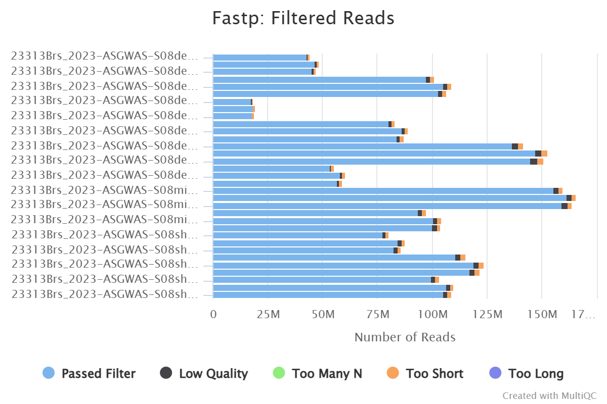
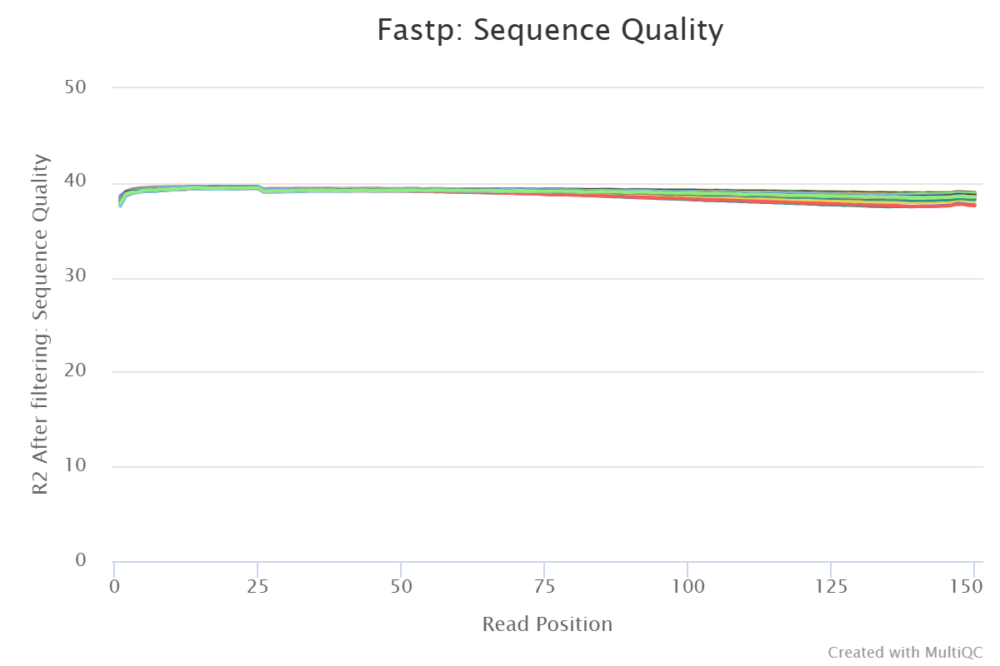

# *Montipora grisea* Host Genotyping Notebook  
Samples from Fagatele Bay collected in 2023  

## 2025-12-22  

Samples copied from Jason's folder of fastqs copied into my directory on the cluster.  

    [kpark049@turing1 fastqs]$ pwd
    /cm/shared/courses/dbarshis/barshislab/KatieP/taxons/Montipora_grisea/2023-Mgri-NMSAS/fastqs
    [kpark049@turing1 fastqs]$ ls
    23313Brs_2023-ASGWAS-S08deep-Mgri-01_R24069_R1.fastq.gz
    23313Brs_2023-ASGWAS-S08deep-Mgri-01_R24069_R2.fastq.gz
    23313Brs_2023-ASGWAS-S08deep-Mgri-01_R24073_R1.fastq.gz
    23313Brs_2023-ASGWAS-S08deep-Mgri-01_R24073_R2.fastq.gz
    23313Brs_2023-ASGWAS-S08deep-Mgri-01_R24074_R1.fastq.gz
    23313Brs_2023-ASGWAS-S08deep-Mgri-01_R24074_R2.fastq.gz
    23313Brs_2023-ASGWAS-S08deep-Mgri-02_R24069_R1.fastq.gz
    23313Brs_2023-ASGWAS-S08deep-Mgri-02_R24069_R2.fastq.gz
    23313Brs_2023-ASGWAS-S08deep-Mgri-02_R24073_R1.fastq.gz
    23313Brs_2023-ASGWAS-S08deep-Mgri-02_R24073_R2.fastq.gz
    23313Brs_2023-ASGWAS-S08deep-Mgri-02_R24074_R1.fastq.gz
    23313Brs_2023-ASGWAS-S08deep-Mgri-02_R24074_R2.fastq.gz
    23313Brs_2023-ASGWAS-S08deep-Mgri-03_R24069_R1.fastq.gz
    23313Brs_2023-ASGWAS-S08deep-Mgri-03_R24069_R2.fastq.gz
    23313Brs_2023-ASGWAS-S08deep-Mgri-03_R24073_R1.fastq.gz
    23313Brs_2023-ASGWAS-S08deep-Mgri-03_R24073_R2.fastq.gz
    23313Brs_2023-ASGWAS-S08deep-Mgri-03_R24074_R1.fastq.gz
    23313Brs_2023-ASGWAS-S08deep-Mgri-03_R24074_R2.fastq.gz
    23313Brs_2023-ASGWAS-S08deep-Mgri-04_R24069_R1.fastq.gz
    23313Brs_2023-ASGWAS-S08deep-Mgri-04_R24069_R2.fastq.gz
    23313Brs_2023-ASGWAS-S08deep-Mgri-04_R24073_R1.fastq.gz
    23313Brs_2023-ASGWAS-S08deep-Mgri-04_R24073_R2.fastq.gz
    23313Brs_2023-ASGWAS-S08deep-Mgri-04_R24074_R1.fastq.gz
    23313Brs_2023-ASGWAS-S08deep-Mgri-04_R24074_R2.fastq.gz
    23313Brs_2023-ASGWAS-S08deep-Mgri-05_R24069_R1.fastq.gz
    23313Brs_2023-ASGWAS-S08deep-Mgri-05_R24069_R2.fastq.gz
    23313Brs_2023-ASGWAS-S08deep-Mgri-05_R24073_R1.fastq.gz
    23313Brs_2023-ASGWAS-S08deep-Mgri-05_R24073_R2.fastq.gz
    23313Brs_2023-ASGWAS-S08deep-Mgri-05_R24074_R1.fastq.gz
    23313Brs_2023-ASGWAS-S08deep-Mgri-05_R24074_R2.fastq.gz
    23313Brs_2023-ASGWAS-S08deep-Mgri-07_R24069_R1.fastq.gz
    23313Brs_2023-ASGWAS-S08deep-Mgri-07_R24069_R2.fastq.gz
    23313Brs_2023-ASGWAS-S08deep-Mgri-07_R24073_R1.fastq.gz
    23313Brs_2023-ASGWAS-S08deep-Mgri-07_R24073_R2.fastq.gz
    23313Brs_2023-ASGWAS-S08deep-Mgri-07_R24074_R1.fastq.gz
    23313Brs_2023-ASGWAS-S08deep-Mgri-07_R24074_R2.fastq.gz
    23313Brs_2023-ASGWAS-S08midd-Mgri-02_R24069_R1.fastq.gz
    23313Brs_2023-ASGWAS-S08midd-Mgri-02_R24069_R2.fastq.gz
    23313Brs_2023-ASGWAS-S08midd-Mgri-02_R24073_R1.fastq.gz
    23313Brs_2023-ASGWAS-S08midd-Mgri-02_R24073_R2.fastq.gz
    23313Brs_2023-ASGWAS-S08midd-Mgri-02_R24074_R1.fastq.gz
    23313Brs_2023-ASGWAS-S08midd-Mgri-02_R24074_R2.fastq.gz
    23313Brs_2023-ASGWAS-S08midd-Mgri-05_R24069_R1.fastq.gz
    23313Brs_2023-ASGWAS-S08midd-Mgri-05_R24069_R2.fastq.gz
    23313Brs_2023-ASGWAS-S08midd-Mgri-05_R24073_R1.fastq.gz
    23313Brs_2023-ASGWAS-S08midd-Mgri-05_R24073_R2.fastq.gz
    23313Brs_2023-ASGWAS-S08midd-Mgri-05_R24074_R1.fastq.gz
    23313Brs_2023-ASGWAS-S08midd-Mgri-05_R24074_R2.fastq.gz
    23313Brs_2023-ASGWAS-S08shall-Mgri-01_R24069_R1.fastq.gz
    23313Brs_2023-ASGWAS-S08shall-Mgri-01_R24069_R2.fastq.gz
    23313Brs_2023-ASGWAS-S08shall-Mgri-01_R24073_R1.fastq.gz
    23313Brs_2023-ASGWAS-S08shall-Mgri-01_R24073_R2.fastq.gz
    23313Brs_2023-ASGWAS-S08shall-Mgri-01_R24074_R1.fastq.gz
    23313Brs_2023-ASGWAS-S08shall-Mgri-01_R24074_R2.fastq.gz
    23313Brs_2023-ASGWAS-S08shall-Mgri-02_R24069_R1.fastq.gz
    23313Brs_2023-ASGWAS-S08shall-Mgri-02_R24069_R2.fastq.gz
    23313Brs_2023-ASGWAS-S08shall-Mgri-02_R24073_R1.fastq.gz
    23313Brs_2023-ASGWAS-S08shall-Mgri-02_R24073_R2.fastq.gz
    23313Brs_2023-ASGWAS-S08shall-Mgri-02_R24074_R1.fastq.gz
    23313Brs_2023-ASGWAS-S08shall-Mgri-02_R24074_R2.fastq.gz
    23313Brs_2023-ASGWAS-S08shall-Mgri-06_R24069_R1.fastq.gz
    23313Brs_2023-ASGWAS-S08shall-Mgri-06_R24069_R2.fastq.gz
    23313Brs_2023-ASGWAS-S08shall-Mgri-06_R24073_R1.fastq.gz
    23313Brs_2023-ASGWAS-S08shall-Mgri-06_R24073_R2.fastq.gz
    23313Brs_2023-ASGWAS-S08shall-Mgri-06_R24074_R1.fastq.gz
    23313Brs_2023-ASGWAS-S08shall-Mgri-06_R24074_R2.fastq.gz  

**Check MD5SUM**  

	md5sum *.fastq.gz > MD5SUMS_23313Brs.txt
    
## 2025-12-23

**Check MD5SUM**  

    [kpark049@coreV3-23-027 fastqs]$ cut -d' ' -f1 MD5SUMS_23313Brs.txt > checksums.txt
    [kpark049@coreV3-23-027 fastqs]$ sort checksums.txt | uniq -d

All files are unique. 

    
	[kpark049@coreV3-23-027 fastqs]$ md5sum -c MD5SUMS_23313Brs.txt | tee md5checks.txt
    23313Brs_2023-ASGWAS-S08deep-Mgri-01_R24069_R1.fastq.gz: OK
    23313Brs_2023-ASGWAS-S08deep-Mgri-01_R24069_R2.fastq.gz: OK
    23313Brs_2023-ASGWAS-S08deep-Mgri-01_R24073_R1.fastq.gz: OK
    23313Brs_2023-ASGWAS-S08deep-Mgri-01_R24073_R2.fastq.gz: OK
    23313Brs_2023-ASGWAS-S08deep-Mgri-01_R24074_R1.fastq.gz: OK
    23313Brs_2023-ASGWAS-S08deep-Mgri-01_R24074_R2.fastq.gz: OK
    23313Brs_2023-ASGWAS-S08deep-Mgri-02_R24069_R1.fastq.gz: OK
    23313Brs_2023-ASGWAS-S08deep-Mgri-02_R24069_R2.fastq.gz: OK
    23313Brs_2023-ASGWAS-S08deep-Mgri-02_R24073_R1.fastq.gz: OK
    23313Brs_2023-ASGWAS-S08deep-Mgri-02_R24073_R2.fastq.gz: OK
    23313Brs_2023-ASGWAS-S08deep-Mgri-02_R24074_R1.fastq.gz: OK
    23313Brs_2023-ASGWAS-S08deep-Mgri-02_R24074_R2.fastq.gz: OK
    23313Brs_2023-ASGWAS-S08deep-Mgri-03_R24069_R1.fastq.gz: OK
    23313Brs_2023-ASGWAS-S08deep-Mgri-03_R24069_R2.fastq.gz: OK
    23313Brs_2023-ASGWAS-S08deep-Mgri-03_R24073_R1.fastq.gz: OK
    23313Brs_2023-ASGWAS-S08deep-Mgri-03_R24073_R2.fastq.gz: OK
    23313Brs_2023-ASGWAS-S08deep-Mgri-03_R24074_R1.fastq.gz: OK
    23313Brs_2023-ASGWAS-S08deep-Mgri-03_R24074_R2.fastq.gz: OK
    23313Brs_2023-ASGWAS-S08deep-Mgri-04_R24069_R1.fastq.gz: OK
    23313Brs_2023-ASGWAS-S08deep-Mgri-04_R24069_R2.fastq.gz: OK
    23313Brs_2023-ASGWAS-S08deep-Mgri-04_R24073_R1.fastq.gz: OK
    23313Brs_2023-ASGWAS-S08deep-Mgri-04_R24073_R2.fastq.gz: OK
    23313Brs_2023-ASGWAS-S08deep-Mgri-04_R24074_R1.fastq.gz: OK
    23313Brs_2023-ASGWAS-S08deep-Mgri-04_R24074_R2.fastq.gz: OK
    23313Brs_2023-ASGWAS-S08deep-Mgri-05_R24069_R1.fastq.gz: OK
    23313Brs_2023-ASGWAS-S08deep-Mgri-05_R24069_R2.fastq.gz: OK
    23313Brs_2023-ASGWAS-S08deep-Mgri-05_R24073_R1.fastq.gz: OK
    23313Brs_2023-ASGWAS-S08deep-Mgri-05_R24073_R2.fastq.gz: OK
    23313Brs_2023-ASGWAS-S08deep-Mgri-05_R24074_R1.fastq.gz: OK
    23313Brs_2023-ASGWAS-S08deep-Mgri-05_R24074_R2.fastq.gz: OK
    23313Brs_2023-ASGWAS-S08deep-Mgri-07_R24069_R1.fastq.gz: OK
    23313Brs_2023-ASGWAS-S08deep-Mgri-07_R24069_R2.fastq.gz: OK
    23313Brs_2023-ASGWAS-S08deep-Mgri-07_R24073_R1.fastq.gz: OK
    23313Brs_2023-ASGWAS-S08deep-Mgri-07_R24073_R2.fastq.gz: OK
    23313Brs_2023-ASGWAS-S08deep-Mgri-07_R24074_R1.fastq.gz: OK
    23313Brs_2023-ASGWAS-S08deep-Mgri-07_R24074_R2.fastq.gz: OK
    23313Brs_2023-ASGWAS-S08midd-Mgri-02_R24069_R1.fastq.gz: OK
    23313Brs_2023-ASGWAS-S08midd-Mgri-02_R24069_R2.fastq.gz: OK
    23313Brs_2023-ASGWAS-S08midd-Mgri-02_R24073_R1.fastq.gz: OK
    23313Brs_2023-ASGWAS-S08midd-Mgri-02_R24073_R2.fastq.gz: OK
    23313Brs_2023-ASGWAS-S08midd-Mgri-02_R24074_R1.fastq.gz: OK
    23313Brs_2023-ASGWAS-S08midd-Mgri-02_R24074_R2.fastq.gz: OK
    23313Brs_2023-ASGWAS-S08midd-Mgri-05_R24069_R1.fastq.gz: OK
    23313Brs_2023-ASGWAS-S08midd-Mgri-05_R24069_R2.fastq.gz: OK
    23313Brs_2023-ASGWAS-S08midd-Mgri-05_R24073_R1.fastq.gz: OK
    23313Brs_2023-ASGWAS-S08midd-Mgri-05_R24073_R2.fastq.gz: OK
    23313Brs_2023-ASGWAS-S08midd-Mgri-05_R24074_R1.fastq.gz: OK
    23313Brs_2023-ASGWAS-S08midd-Mgri-05_R24074_R2.fastq.gz: OK
    23313Brs_2023-ASGWAS-S08shall-Mgri-01_R24069_R1.fastq.gz: OK
    23313Brs_2023-ASGWAS-S08shall-Mgri-01_R24069_R2.fastq.gz: OK
    23313Brs_2023-ASGWAS-S08shall-Mgri-01_R24073_R1.fastq.gz: OK
    23313Brs_2023-ASGWAS-S08shall-Mgri-01_R24073_R2.fastq.gz: OK
    23313Brs_2023-ASGWAS-S08shall-Mgri-01_R24074_R1.fastq.gz: OK
    23313Brs_2023-ASGWAS-S08shall-Mgri-01_R24074_R2.fastq.gz: OK
    23313Brs_2023-ASGWAS-S08shall-Mgri-02_R24069_R1.fastq.gz: OK
    23313Brs_2023-ASGWAS-S08shall-Mgri-02_R24069_R2.fastq.gz: OK
    23313Brs_2023-ASGWAS-S08shall-Mgri-02_R24073_R1.fastq.gz: OK
    23313Brs_2023-ASGWAS-S08shall-Mgri-02_R24073_R2.fastq.gz: OK
    23313Brs_2023-ASGWAS-S08shall-Mgri-02_R24074_R1.fastq.gz: OK
    23313Brs_2023-ASGWAS-S08shall-Mgri-02_R24074_R2.fastq.gz: OK
    23313Brs_2023-ASGWAS-S08shall-Mgri-06_R24069_R1.fastq.gz: OK
    23313Brs_2023-ASGWAS-S08shall-Mgri-06_R24069_R2.fastq.gz: OK
    23313Brs_2023-ASGWAS-S08shall-Mgri-06_R24073_R1.fastq.gz: OK
    23313Brs_2023-ASGWAS-S08shall-Mgri-06_R24073_R2.fastq.gz: OK
    23313Brs_2023-ASGWAS-S08shall-Mgri-06_R24074_R1.fastq.gz: OK
    23313Brs_2023-ASGWAS-S08shall-Mgri-06_R24074_R2.fastq.gz: OK

Double check all files have been checked 

    [kpark049@coreV3-23-027 fastqs]$ ls *.fastq.gz | wc -l
    66
    [kpark049@coreV3-23-027 fastqs]$ wc -l md5checks.txt
    66 md5checks.txt

Files are good to go :)
___

**Trimming and QC**  

make name of all samples (unique file names after removing _R1 or _R2.fastq.gz)

    [kpark049@coreV3-23-027 fastqs]$ ls *.fastq.gz | sed -E 's/_R[12].fastq.gz//' | sort | uniq > sample_list.txt
   
    [kpark049@coreV3-23-027 fastqs]$ cat sample_list.txt
    23313Brs_2023-ASGWAS-S08deep-Mgri-01_R24069
    23313Brs_2023-ASGWAS-S08deep-Mgri-01_R24073
    23313Brs_2023-ASGWAS-S08deep-Mgri-01_R24074
    23313Brs_2023-ASGWAS-S08deep-Mgri-02_R24069
    23313Brs_2023-ASGWAS-S08deep-Mgri-02_R24073
    23313Brs_2023-ASGWAS-S08deep-Mgri-02_R24074
    23313Brs_2023-ASGWAS-S08deep-Mgri-03_R24069
    23313Brs_2023-ASGWAS-S08deep-Mgri-03_R24073
    23313Brs_2023-ASGWAS-S08deep-Mgri-03_R24074
    23313Brs_2023-ASGWAS-S08deep-Mgri-04_R24069
    23313Brs_2023-ASGWAS-S08deep-Mgri-04_R24073
    23313Brs_2023-ASGWAS-S08deep-Mgri-04_R24074
    23313Brs_2023-ASGWAS-S08deep-Mgri-05_R24069
    23313Brs_2023-ASGWAS-S08deep-Mgri-05_R24073
    23313Brs_2023-ASGWAS-S08deep-Mgri-05_R24074
    23313Brs_2023-ASGWAS-S08deep-Mgri-07_R24069
    23313Brs_2023-ASGWAS-S08deep-Mgri-07_R24073
    23313Brs_2023-ASGWAS-S08deep-Mgri-07_R24074
    23313Brs_2023-ASGWAS-S08midd-Mgri-02_R24069
    23313Brs_2023-ASGWAS-S08midd-Mgri-02_R24073
    23313Brs_2023-ASGWAS-S08midd-Mgri-02_R24074
    23313Brs_2023-ASGWAS-S08midd-Mgri-05_R24069
    23313Brs_2023-ASGWAS-S08midd-Mgri-05_R24073
    23313Brs_2023-ASGWAS-S08midd-Mgri-05_R24074
    23313Brs_2023-ASGWAS-S08shall-Mgri-01_R24069
    23313Brs_2023-ASGWAS-S08shall-Mgri-01_R24073
    23313Brs_2023-ASGWAS-S08shall-Mgri-01_R24074
    23313Brs_2023-ASGWAS-S08shall-Mgri-02_R24069
    23313Brs_2023-ASGWAS-S08shall-Mgri-02_R24073
    23313Brs_2023-ASGWAS-S08shall-Mgri-02_R24074
    23313Brs_2023-ASGWAS-S08shall-Mgri-06_R24069
    23313Brs_2023-ASGWAS-S08shall-Mgri-06_R24073
    23313Brs_2023-ASGWAS-S08shall-Mgri-06_R24074
    
    
made directories for organization and moved MD5Check outputs 

    fastp_reports
    fastp.slurm
    MD5Check
    sample_data
    trimmed_fastq

fastp sbatch script

    [kpark049@coreV3-23-027 fastqs]$ nano fastp.slurm

    #!/bin/bash -l

    #SBATCH --job-name=fastp_array_2025-12-23
    #SBATCH --output=%A_%a_%x.out
    #SBATCH --error=%A_%a_%x.err
    #SBATCH --mail-type=ALL
    #SBATCH --mail-user=kpark049@odu.edu
    #SBATCH --partition=main
    #SBATCH --array=1-66
    #SBATCH --ntasks=1
    #SBATCH --mem=30G
    #SBATCH --time=7-00:00:00

    ## Load modules
    module load container_env
    module load fastp

    ## Define some variables
    BASEDIR=/cm/shared/courses/dbarshis/barshislab/KatieP/taxons/Montipora_grisea/2023-Mgri-NMSAS/
    RAWDATA=$BASEDIR/fastqs #path to raw fq.gz files
    OUTDIR=$BASEDIR/fastqs/trimmed_fastq
    SAMPLELIST=$BASEDIR/fastqs/sample_data/sample_list.txt # Path to a list of prefixes of the raw fastq files. It can be a subset of the the 1st column of the sample table (without the header line).
    SAMPLETABLE=$BASEDIR/fastqs/sample_data/sample_table.txt # Path to a sample table where the 1st column is the prefix of the raw fastq files. The 4th column is the sample ID, the 2nd column is the lane number, and the 3rd column is sequence ID. The combination of these three columns have to be unique. The 6th column should be data type, which is either pe or se.
    RAW_R1=_R1.fastq.gz # Suffix to raw fastq files. Use forward reads with paired-end data.
    RAW_R2=_R2.fastq.gz # Suffix to raw fastq files. Use reverse reads with paired-end data.

    ## Keep a record of the Job ID
    echo $SLURM_JOB_ID

    ## Select the SAMPLE from the SAMPLELIST
    SAMPLEFILE=`head $SAMPLELIST -n $SLURM_ARRAY_TASK_ID | tail -n 1`

    ## Keep record of sample file
    echo $SAMPLEFILE

    ## Extract relevant values from a table of sample, sequencing, and lane ID (here in columns 4, 3, 2, respectively) for each sequenced library. This is for the naming of trimmed/processed files
    SAMPLE_ID=`grep -P "${SAMPLEFILE}\t" $SAMPLETABLE | cut -f 4`
    POP_ID=`grep -P "${SAMPLEFILE}\t" $SAMPLETABLE | cut -f 5`
    SEQ_ID=`grep -P "${SAMPLEFILE}\t" $SAMPLETABLE | cut -f 3`
    LANE_ID=`grep -P "${SAMPLEFILE}\t" $SAMPLETABLE | cut -f 2`
    PREP_ID=`grep -P "${SAMPLEFILE}\t" $SAMPLETABLE | cut -f 13`
    SAMPLE_UNIQ_ID=$SAMPLE_ID'_'$SEQ_ID'_'$PREP_ID'_'$LANE_ID  # When a sample has been sequenced in multiple lanes, we need to be able to identify the files from each run uniquely

    echo $SAMPLE_UNIQ_ID

    ## Define the output path and file prefix
    SAMPLETRIM=$OUTDIR/$SAMPLE_UNIQ_ID

    ## Run fastp
    crun.fastp fastp -i $RAWDATA/$SAMPLEFILE$RAW_R1 \
        -I $RAWDATA/$SAMPLEFILE$RAW_R2 \
        -o ${SAMPLETRIM}_f_paired_trim.fastq.gz \
        -O ${SAMPLETRIM}_r_paired_trim.fastq.gz \
        --adapter_fasta /archive/barshis/barshislab/jtoy/pver_gwas/pver_gwas_batch3/adapters.fa \
        --cut_tail \
        --trim_poly_g \
        -l 40 \
        -h $BASEDIR/fastqs/fastp_reports/${SAMPLE_UNIQ_ID}_fastp.html \
        -j $BASEDIR/fastqs/fastp_reports/${SAMPLE_UNIQ_ID}_fastp.json \
        --thread 16

Made sample_table.txt in Excel then pasted to cluster

	[kpark049@coreV3-23-027 sample_data]$ head sample_table.txt 
    23313Brs_2023-ASGWAS-S08deep-Mgri-01_R24069_R1  R24069  1       S08deep-Mgri-01    pe
    23313Brs_2023-ASGWAS-S08deep-Mgri-01_R24069_R2  R24069  1       S08deep-Mgri-01    pe
    23313Brs_2023-ASGWAS-S08deep-Mgri-01_R24073_R1  R24073  1       S08deep-Mgri-01    pe
    23313Brs_2023-ASGWAS-S08deep-Mgri-01_R24073_R2  R24073  1       S08deep-Mgri-01    pe
    23313Brs_2023-ASGWAS-S08deep-Mgri-01_R24074_R1  R24074  1       S08deep-Mgri-01    pe
    23313Brs_2023-ASGWAS-S08deep-Mgri-01_R24074_R2  R24074  1       S08deep-Mgri-01    pe
    23313Brs_2023-ASGWAS-S08deep-Mgri-02_R24069_R1  R24069  1       S08deep-Mgri-02    pe
    23313Brs_2023-ASGWAS-S08deep-Mgri-02_R24069_R2  R24069  1       S08deep-Mgri-02    pe
    23313Brs_2023-ASGWAS-S08deep-Mgri-02_R24073_R1  R24073  1       S08deep-Mgri-02    pe
    23313Brs_2023-ASGWAS-S08deep-Mgri-02_R24073_R2  R24073  1       S08deep-Mgri-02    pe

Adapters from Jason's directory: 

    [kpark049@coreV3-23-027 pver_gwas_batch3]$ pwd
    /archive/barshis/barshislab/jtoy/pver_gwas/pver_gwas_batch3

    [kpark049@coreV3-23-027 pver_gwas_batch3]$ cat adapters.fa
    >Illumina TruSeq Adapter Read 1
    AGATCGGAAGAGCACACGTCTGAACTCCAGTCA
    >Illumina TruSeq Adapter Read 2
    AGATCGGAAGAGCGTCGTGTAGGGAAAGAGTGT
    >index i7a
    GATCGGAAGAGCACACGTCTGAACTCCAGTCAC
    >index i7b
    ATCTCGTATGCCGTCTTCTGCTTG
    >index i5a
    AATGATACGGCGACCACCGAGATCTACAC
    >index i5b
    ACACTCTTTCCCTACACGACGCTCTTCCGATCT

Submitted Job ~ 4:30PM Central Time

    [kpark049@coreV3-23-027 fastqs]$ sbatch fastp.slurm 
    Submitted batch job 10784309

## 2026-01-02
**Output from running the fastp.slurm**

    [kpark049@coreV3-23-027 fastqs]$ pwd
    /cm/shared/courses/dbarshis/barshislab/KatieP/taxons/Montipora_grisea/2023-Mgri-NMSAS/fastqs
    [kpark049@coreV3-23-027 fastqs]$ ls
    10784309_10_fastp_array_2025-12-23.err  10784309_57_fastp_array_2025-12-23.err
    10784309_10_fastp_array_2025-12-23.out  10784309_57_fastp_array_2025-12-23.out
    10784309_11_fastp_array_2025-12-23.err  10784309_58_fastp_array_2025-12-23.err
    10784309_11_fastp_array_2025-12-23.out  10784309_58_fastp_array_2025-12-23.out
    10784309_12_fastp_array_2025-12-23.err  10784309_59_fastp_array_2025-12-23.err
    10784309_12_fastp_array_2025-12-23.out  10784309_59_fastp_array_2025-12-23.out
    10784309_13_fastp_array_2025-12-23.err  10784309_5_fastp_array_2025-12-23.err
    10784309_13_fastp_array_2025-12-23.out  10784309_5_fastp_array_2025-12-23.out
    10784309_14_fastp_array_2025-12-23.err  10784309_60_fastp_array_2025-12-23.err
    10784309_14_fastp_array_2025-12-23.out  10784309_60_fastp_array_2025-12-23.out
    10784309_15_fastp_array_2025-12-23.err  10784309_61_fastp_array_2025-12-23.err
    10784309_15_fastp_array_2025-12-23.out  10784309_61_fastp_array_2025-12-23.out
    10784309_16_fastp_array_2025-12-23.err  10784309_62_fastp_array_2025-12-23.err
    10784309_16_fastp_array_2025-12-23.out  10784309_62_fastp_array_2025-12-23.out
    10784309_17_fastp_array_2025-12-23.err  10784309_63_fastp_array_2025-12-23.err
    10784309_17_fastp_array_2025-12-23.out  10784309_63_fastp_array_2025-12-23.out
    10784309_18_fastp_array_2025-12-23.err  10784309_64_fastp_array_2025-12-23.err
    10784309_18_fastp_array_2025-12-23.out  10784309_64_fastp_array_2025-12-23.out
    10784309_19_fastp_array_2025-12-23.err  10784309_65_fastp_array_2025-12-23.err
    10784309_19_fastp_array_2025-12-23.out  10784309_65_fastp_array_2025-12-23.out
    10784309_1_fastp_array_2025-12-23.err   10784309_66_fastp_array_2025-12-23.err
    10784309_1_fastp_array_2025-12-23.out   10784309_66_fastp_array_2025-12-23.out
    10784309_20_fastp_array_2025-12-23.err  10784309_6_fastp_array_2025-12-23.err
    10784309_20_fastp_array_2025-12-23.out  10784309_6_fastp_array_2025-12-23.out
    10784309_21_fastp_array_2025-12-23.err  10784309_7_fastp_array_2025-12-23.err
    10784309_21_fastp_array_2025-12-23.out  10784309_7_fastp_array_2025-12-23.out
    10784309_22_fastp_array_2025-12-23.err  10784309_8_fastp_array_2025-12-23.err
    10784309_22_fastp_array_2025-12-23.out  10784309_8_fastp_array_2025-12-23.out
    10784309_23_fastp_array_2025-12-23.err  10784309_9_fastp_array_2025-12-23.err
    10784309_23_fastp_array_2025-12-23.out  10784309_9_fastp_array_2025-12-23.out
    10784309_24_fastp_array_2025-12-23.err  23313Brs_2023-ASGWAS-S08deep-Mgri-01_R24069_R1.fastq.gz
    10784309_24_fastp_array_2025-12-23.out  23313Brs_2023-ASGWAS-S08deep-Mgri-01_R24069_R2.fastq.gz
    10784309_25_fastp_array_2025-12-23.err  23313Brs_2023-ASGWAS-S08deep-Mgri-01_R24073_R1.fastq.gz
    10784309_25_fastp_array_2025-12-23.out  23313Brs_2023-ASGWAS-S08deep-Mgri-01_R24073_R2.fastq.gz
    10784309_26_fastp_array_2025-12-23.err  23313Brs_2023-ASGWAS-S08deep-Mgri-01_R24074_R1.fastq.gz
    10784309_26_fastp_array_2025-12-23.out  23313Brs_2023-ASGWAS-S08deep-Mgri-01_R24074_R2.fastq.gz
    ...
    [kpark049@coreV3-23-027 fastp_reports]$ pwd
    /cm/shared/courses/dbarshis/barshislab/KatieP/taxons/Montipora_grisea/2023-Mgri-NMSAS/fastqs/fastp_reports
    [kpark049@coreV3-23-027 fastp_reports]$ ls
    ____fastp.html  ____fastp.json

Issue with output naming. 

**Recap of what I did and output:**

The sample_list.txt file was generated by stripping _R1/_R2.fastq.gz from filenames, producing one prefix per FASTQ pair. Validation confirmed that every prefix in sample_list.txt has both corresponding R1 and R2 files present, so the input FASTQs and array-based fastp strategy are correct.

fastp jobs successfully launched via a SLURM array, but output report files were named ____fastp.html/json, indicating that the variable used to construct unique output names (SAMPLE_UNIQ_ID) was empty. This traced back to a failure when extracting metadata from sample_table.txt.

Specifically, the FASTQ prefixes in sample_list.txt did not match exactly with the identifiers in column 1 of sample_table.txt (or the table delimiter differed), causing all grep lookups to return no matches. As a result, sample, lane, run, and prep IDs were not populated, breaking downstream file naming even though fastp itself ran.

Conclusion:
The trimming step itself executed correctly and input data are intact. The remaining issue is a string-matching / formatting mismatch between FASTQ prefixes and the sample metadata table, not a problem with WGS handling, file presence, or fastp parameters.

**Moved previous output to new directory**

    [kpark049@coreV3-23-027 2025-12-23_failed_fastp_run_output]$ pwd
    /cm/shared/courses/dbarshis/barshislab/KatieP/taxons/Montipora_grisea/2023-Mgri-NMSAS/fastqs/2025-12-23_failed_fastp_run_output
    kpark049@coreV3-23-027 2025-12-23_failed_fastp_run_output]$ls 
     2025-12-23_fastp.slurm
    10784309_2_fastp_array_2025-12-23.out   10784309_50_fastp_array_2025-12-23.err
    *all other .out and .err files
      fastp_reports
      trimmed_fastq

**updated fastp.slurm to correct file output naming issue**

    [kpark049@coreV3-23-027 fastqs]$ cat fastp.slurm
    #!/bin/bash -l

    #SBATCH --job-name=fastp_array_2026-01-02
    #SBATCH --output=%A_%a_%x.out
    #SBATCH --error=%A_%a_%x.err
    #SBATCH --mail-type=ALL
    #SBATCH --mail-user=kpark049@odu.edu
    #SBATCH --partition=main
    #SBATCH --array=1-66
    #SBATCH --ntasks=1
    #SBATCH --mem=30G
    #SBATCH --time=7-00:00:00

    ## Load modules
    module load container_env
    module load fastp

    ## Define some variables
    BASEDIR=/cm/shared/courses/dbarshis/barshislab/KatieP/taxons/Montipora_grisea/2023-Mgri-NMSAS/
    RAWDATA=$BASEDIR/fastqs
    OUTDIR=$BASEDIR/fastqs/trimmed_fastqs
    SAMPLELIST=$BASEDIR/fastqs/sample_data/sample_list.txt
    RAW_R1=_R1.fastq.gz
    RAW_R2=_R2.fastq.gz

    ## Keep a record of the Job ID
    echo $SLURM_JOB_ID

    ## Select the SAMPLE from the SAMPLELIST
    SAMPLEFILE=`head $SAMPLELIST -n $SLURM_ARRAY_TASK_ID | tail -n 1`
    echo $SAMPLEFILE

    ## Define the output path and file prefix using the FASTQ prefix for uniqueness
    SAMPLE_UNIQ_ID=$SAMPLEFILE
    SAMPLETRIM=$OUTDIR/$SAMPLE_UNIQ_ID

    ## Run fastp
    crun.fastp fastp \
        -i $RAWDATA/${SAMPLEFILE}_R1.fastq.gz \
        -I $RAWDATA/${SAMPLEFILE}_R2.fastq.gz \
        -o ${SAMPLETRIM}_R1_trimmed.fastq.gz \
        -O ${SAMPLETRIM}_R2_trimmed.fastq.gz \
        --adapter_fasta /archive/barshis/barshislab/jtoy/pver_gwas/pver_gwas_batch3/adapters.fa \
        --cut_tail \
        --trim_poly_g \
        -l 40 \
        -h $BASEDIR/fastqs/fastp_reports/${SAMPLE_UNIQ_ID}_fastp.html \
        -j $BASEDIR/fastqs/fastp_reports/${SAMPLE_UNIQ_ID}_fastp.json \
        --thread 16

**make sure direcotry running script looks like this (ie trimmed_fastqs and fastp_reports directory for script output)

    [kpark049@coreV3-23-027 fastqs]$ pwd
    /cm/shared/courses/dbarshis/barshislab/KatieP/taxons/Montipora_grisea/2023-Mgri-NMSAS/fastqs

	*all fastq.gz files to trim*
     fastp_reports
     fastp.slurm
     MD5Check
     sample_data
     trimmed_fastqs

Started job at 1:27PM on 2026-01-02

    [kpark049@coreV3-23-040 fastqs]$ sbatch fastp.slurm
    Submitted batch job 10784730

## 2025-01-06: Confirming Fastp and MultiQC
Fastp worked

    
    
    [kpark049@turing1 trimmed_fastqs]$ pwd
    /cm/shared/courses/dbarshis/barshislab/KatieP/taxons/Montipora_grisea/2023-Mgri-NMSAS/fastqs/trimmed_fastqs
    
    [kpark049@turing1 fastp_reports] ls -U | head -10
    23313Brs_2023-ASGWAS-S08deep-Mgri-02_R24074_R2_trimmed.fastq.gz
    23313Brs_2023-ASGWAS-S08midd-Mgri-02_R24074_R2_trimmed.fastq.gz
    23313Brs_2023-ASGWAS-S08deep-Mgri-01_R24073_R1_trimmed.fastq.gz
    23313Brs_2023-ASGWAS-S08deep-Mgri-03_R24074_R1_trimmed.fastq.gz
    23313Brs_2023-ASGWAS-S08deep-Mgri-01_R24069_R2_trimmed.fastq.gz
    23313Brs_2023-ASGWAS-S08deep-Mgri-03_R24069_R1_trimmed.fastq.gz
    23313Brs_2023-ASGWAS-S08deep-Mgri-04_R24069_R1_trimmed.fastq.gz
    23313Brs_2023-ASGWAS-S08deep-Mgri-07_R24073_R2_trimmed.fastq.gz
    23313Brs_2023-ASGWAS-S08shall-Mgri-06_R24069_R2_trimmed.fastq.gz
    23313Brs_2023-ASGWAS-S08deep-Mgri-05_R24074_R2_trimmed.fastq.gz

    kpark049@turing1 fastp_reports]$ pwd
    /cm/shared/courses/dbarshis/barshislab/KatieP/taxons/Montipora_grisea/2023-Mgri-NMSAS/fastqs/fastp_reports
    [kpark049@turing1 fastp_reports]$ ls -U | head -10
    23313Brs_2023-ASGWAS-S08midd-Mgri-02_R24069_fastp.json
    23313Brs_2023-ASGWAS-S08shall-Mgri-01_R24073_fastp.html
    23313Brs_2023-ASGWAS-S08midd-Mgri-05_R24069_fastp.json
    23313Brs_2023-ASGWAS-S08shall-Mgri-06_R24073_fastp.json
    23313Brs_2023-ASGWAS-S08deep-Mgri-07_R24074_fastp.json
    23313Brs_2023-ASGWAS-S08deep-Mgri-07_R24073_fastp.html
    23313Brs_2023-ASGWAS-S08deep-Mgri-01_R24074_fastp.html
    23313Brs_2023-ASGWAS-S08deep-Mgri-07_R24074_fastp.html
    23313Brs_2023-ASGWAS-S08midd-Mgri-05_R24074_fastp.html
    23313Brs_2023-ASGWAS-S08deep-Mgri-05_R24074_fastp.html
    
    [kpark049@turing1 fastp_reports]$ ls *.json | wc -l
    33
    
    [kpark049@turing1 fastp_reports]$ ls *.html | wc -l
    33

**Running MultiQC**

    [kpark049@turing1 fastp_reports]$ pwd
    /cm/shared/courses/dbarshis/barshislab/KatieP/taxons/Montipora_grisea/2023-Mgri-NMSAS/fastqs/fastp_reports
    
    [kpark049@turing1 fastp_reports]$ salloc
    salloc: Pending job allocation 10785002
    salloc: job 10785002 queued and waiting for resources
    salloc: job 10785002 has been allocated resources
    salloc: Granted job allocation 10785002
    salloc: Nodes coreV3-23-027 are ready for job
    
    [kpark049@coreV3-23-027 fastp_reports]$ module load container_env
    
    [kpark049@coreV3-23-027 fastp_reports]$ module load multiqc/1.13
   
    [kpark049@coreV3-23-027 fastp_reports]$ crun.multiqc multiqc --interactive --filename 2026-01-06_multiqc_report .
     /// MultiQC 🔍 | v1.13
    |           multiqc | MultiQC Version v1.33 now available!
    |           multiqc | Search path : /cm/shared/courses/dbarshis/barshislab/KatieP/taxons/Montipora_grisea/2023-Mgri-NMSAS/fastqs/fastp_reports
    |         searching | ━━━━━━━━━━━━━━━━━━━━━━━━━━━━━━━━━━━━━━━━ 100% 198/198
    |             fastp | Found 33 reports
    |           multiqc | Compressing plot data
    |           multiqc | Report      : 2026-01-06_multiqc_report.html
    |           multiqc | Data        : 2026-01-06_multiqc_report_data
    |           multiqc | MultiQC complete

Copy MultiQC report locally 

    kpark@KatiesPC MINGW64 ~/OneDrive/Documents/Barshis_Lab/Field_Work/2023-March-April_American-Samoa/data/Sequencing (main)
    $ pwd
    /c/Users/kpark/OneDrive/Documents/Barshis_Lab/Field_Work/2023-March-April_American-Samoa/data/Sequencing
    
    kpark@KatiesPC MINGW64 ~/OneDrive/Documents/Barshis_Lab/Field_Work/2023-March-April_American-Samoa/data/Sequencing (main)
    $ scp kpark049@turing.hpc.odu.edu:/cm/shared/courses/dbarshis/barshislab/KatieP/taxons/Montipora_grisea/2023-Mgri-NMSAS/fastqs/fastp_reports/2026-01-06_multiqc_report.html ./
    (kpark049@turing.hpc.odu.edu) Password:
    (kpark049@turing.hpc.odu.edu) Duo two-factor login for kpark049

    Enter a passcode or select one of the following options:

     1. Duo Push to XXX-XXX-6957
     2. SMS passcodes to XXX-XXX-6957 (next code starts with: 2)

    Passcode or option (1-2): 1
    Success. Logging you in...
    2026-01-06_multiqc_report.html 

Samples look good overall! 

| Sample Name | % Duplication | GC content | % PF | % Adapter |
|-------------|---------------|------------|------|-----------|
| 23313Brs_2023-ASGWAS-S08midd-Mgri-02_R24069_R1 | 22.7% | 43.7% | 97.4% | 17.2% |
| 23313Brs_2023-ASGWAS-S08midd-Mgri-02_R24074_R1 | 20.9% | 43.8% | 97.4% | 18.4% |
| 23313Brs_2023-ASGWAS-S08midd-Mgri-02_R24073_R1 | 20.6% | 43.8% | 97.4% | 18.5% |
| 23313Brs_2023-ASGWAS-S08deep-Mgri-02_R24069_R1 | 18.9% | 46.9% | 96.5% | 28.0% |
| 23313Brs_2023-ASGWAS-S08deep-Mgri-04_R24069_R1 | 19.5% | 42.1% | 96.8% | 28.4% |
| 23313Brs_2023-ASGWAS-S08deep-Mgri-03_R24069_R1 | 34.1% | 24.7% | 95.4% | 28.9% |
| 23313Brs_2023-ASGWAS-S08deep-Mgri-02_R24073_R1 | 17.3% | 47.1% | 96.6% | 29.5% |
| 23313Brs_2023-ASGWAS-S08deep-Mgri-02_R24074_R1 | 17.4% | 47.1% | 96.4% | 29.6% |
| 23313Brs_2023-ASGWAS-S08deep-Mgri-04_R24073_R1 | 17.6% | 42.3% | 96.8% | 30.3% |
| 23313Brs_2023-ASGWAS-S08deep-Mgri-04_R24074_R1 | 17.7% | 42.4% | 96.6% | 30.3% |
| 23313Brs_2023-ASGWAS-S08shall-Mgri-06_R24069_R1 | 19.2% | 43.2% | 96.8% | 30.7% |
| 23313Brs_2023-ASGWAS-S08deep-Mgri-03_R24073_R1 | 30.7% | 25.0% | 95.1% | 30.8% |
| 23313Brs_2023-ASGWAS-S08shall-Mgri-02_R24069_R1 | 17.9% | 43.5% | 96.2% | 31.3% |
| 23313Brs_2023-ASGWAS-S08deep-Mgri-03_R24074_R1 | 29.9% | 25.7% | 94.9% | 31.5% |
| 23313Brs_2023-ASGWAS-S08shall-Mgri-06_R24074_R1 | 17.8% | 43.3% | 96.7% | 32.6% |
| 23313Brs_2023-ASGWAS-S08midd-Mgri-05_R24069_R1 | 18.9% | 46.3% | 96.5% | 32.7% |
| 23313Brs_2023-ASGWAS-S08shall-Mgri-06_R24073_R1 | 17.4% | 43.3% | 96.8% | 32.7% |
| 23313Brs_2023-ASGWAS-S08deep-Mgri-01_R24069_R1 | 19.7% | 39.8% | 96.0% | 32.8% |
| 23313Brs_2023-ASGWAS-S08deep-Mgri-05_R24069_R1 | 18.1% | 47.7% | 96.3% | 32.8% |
| 23313Brs_2023-ASGWAS-S08shall-Mgri-02_R24074_R1 | 16.7% | 43.7% | 96.1% | 33.1% |
| 23313Brs_2023-ASGWAS-S08shall-Mgri-02_R24073_R1 | 16.3% | 43.7% | 96.2% | 33.2% |
| 23313Brs_2023-ASGWAS-S08deep-Mgri-05_R24073_R1 | 16.8% | 47.9% | 96.3% | 34.3% |
| 23313Brs_2023-ASGWAS-S08deep-Mgri-05_R24074_R1 | 17.0% | 47.9% | 96.2% | 34.4% |
| 23313Brs_2023-ASGWAS-S08midd-Mgri-05_R24074_R1 | 17.7% | 46.5% | 96.4% | 34.5% |
| 23313Brs_2023-ASGWAS-S08midd-Mgri-05_R24073_R1 | 17.3% | 46.5% | 96.5% | 34.7% |
| 23313Brs_2023-ASGWAS-S08deep-Mgri-01_R24074_R1 | 17.8% | 40.3% | 95.8% | 34.8% |
| 23313Brs_2023-ASGWAS-S08deep-Mgri-01_R24073_R1 | 17.8% | 40.1% | 96.0% | 34.9% |
| 23313Brs_2023-ASGWAS-S08shall-Mgri-01_R24069_R1 | 15.5% | 42.9% | 96.5% | 39.3% |
| 23313Brs_2023-ASGWAS-S08deep-Mgri-07_R24069_R1 | 16.7% | 42.7% | 96.3% | 40.4% |
| 23313Brs_2023-ASGWAS-S08shall-Mgri-01_R24074_R1 | 14.6% | 43.1% | 96.3% | 41.2% |
| 23313Brs_2023-ASGWAS-S08shall-Mgri-01_R24073_R1 | 14.2% | 43.1% | 96.4% | 41.4% |
| 23313Brs_2023-ASGWAS-S08deep-Mgri-07_R24073_R1 | 15.2% | 42.9% | 96.2% | 42.4% |
| 23313Brs_2023-ASGWAS-S08deep-Mgri-07_R24074_R1 | 15.3% | 42.9% | 96.1% | 42.4% |

## 2026-02-06: Map reads to genome
Copy genome to my directory 

    [kpark049@coreV3-23-027 2022-12_WildGenomesMgrisGenome]$ pwd
    /RC/group/rc_barshis_lab/taxonarchive/Montipora_grisea/2022-12_WildGenomesMgrisGenome
    
    [kpark049@coreV3-23-027 2022-12_WildGenomesMgrisGenome]$ cp full_genome_scaffolds_Mgri_0.1.fasta /cm/shared/courses/dbarshis/barshislab/KatieP/taxons/Montipora_grisea/2023-Mgri-NMSAS/
    
    [kpark049@coreV3-23-027 /]$ cd /cm/shared/courses/dbarshis/barshislab/KatieP/taxons/Montipora_grisea/2023-Mgri-NMSAS/
    
    [kpark049@coreV3-23-027 2023-Mgri-NMSAS]$ ls
    fastqs  full_genome_scaffolds_Mgri_0.1.fasta
    
    [kpark049@coreV3-23-027 2023-Mgri-NMSAS]$ mkdir mgris_genome
    
    [kpark049@coreV3-23-027 2023-Mgri-NMSAS]$ mv full_genome_scaffolds_Mgri_0.1.fasta mgris_genome/
    
    [kpark049@coreV3-23-027 2023-Mgri-NMSAS]$ ls
    fastqs  mgris_genome
    
index genome

    [kpark049@coreV3-23-027 mgris_genome]$ pwd
    /cm/shared/courses/dbarshis/barshislab/KatieP/taxons/Montipora_grisea/2023-Mgri-NMSAS/mgris_genome
    
    [kpark049@coreV3-23-027 mgris_genome]$ ls
    full_genome_scaffolds_Mgri_0.1.fasta
    
    [kpark049@coreV3-23-027 mgris_genome]$ module load bowtie2

    [kpark049@coreV3-23-027 mgris_genome]$ crun.bowtie2 bowtie2-build full_genome_scaffolds_Mgri_0.1.fasta full_genome_scaffolds_Mgri_0.1
    Settings:
      Output files: "full_genome_scaffolds_Mgri_0.1.*.bt2"
      Line rate: 6 (line is 64 bytes)
      Lines per side: 1 (side is 64 bytes)
      Offset rate: 4 (one in 16)
      ...
      
    [kpark049@turing1 mgris_genome]$ ls
    full_genome_scaffolds_Mgri_0.1.1.bt2  full_genome_scaffolds_Mgri_0.1.fasta
    full_genome_scaffolds_Mgri_0.1.2.bt2  full_genome_scaffolds_Mgri_0.1.rev.1.bt2
    full_genome_scaffolds_Mgri_0.1.3.bt2  full_genome_scaffolds_Mgri_0.1.rev.2.bt2
    full_genome_scaffolds_Mgri_0.1.4.bt2

Now ready to run Bowtie2 

## 2026-01-07: Running BowTie2 - Did not work :(
Making a scripts folder to try and keep things organized 

    [kpark049@turing1 2023-Mgri-NMSAS]$ mkdir scripts
    
    [kpark049@turing1 2023-Mgri-NMSAS]$ ls
    bam  fastqs  mgris_genome  scripts
    
    [kpark049@turing1 2023-Mgri-NMSAS]$ cd scripts/

2026-01-07_bowtie2_mapping.slurm

    [kpark049@turing1 scripts]$ nano 2026-01-07_bowtie2_mapping.slurm
    
    #!/bin/bash -l

    #SBATCH --job-name=hologenome_mapping_2026-01-06
    #SBATCH --output=%A_%a_%x.out
    #SBATCH --error=%A_%a_%x.err
    #SBATCH --mail-type=ALL
    #SBATCH --mail-user=kpark049@odu.edu
    #SBATCH --partition=main
    #SBATCH --array=1-33      # One array task per sample
    #SBATCH --ntasks=1
    #SBATCH --mem=30G
    #SBATCH --time=7-00:00:00

    ## Load modules
    module load container_env
    module load bowtie2

    ## Define directories and files
    BASEDIR=/cm/shared/courses/dbarshis/barshislab/KatieP/taxons/Montipora_grisea/2023-Mgri-NMSAS
    FASTQDIR=$BASEDIR/fastqs/trimmed_fastqs           # path to trimmed fastq.gz files
    OUTDIR=$BASEDIR/bam                                # output directory for BAM files
    SAMPLELIST=$BASEDIR/fastqs/sample_data/sample_list.txt    # list of sample prefixes

    ## Keep a record of the SLURM job
    echo "SLURM_JOB_ID: $SLURM_JOB_ID"

    ## Select the sample for this array task
    SAMPLEFILE=$(head -n $SLURM_ARRAY_TASK_ID $SAMPLELIST | tail -n 1)
    echo "Processing sample: $SAMPLEFILE"

    ## Define output BAM prefix
    SAMPLEOUT=$OUTDIR/$SAMPLEFILE

    ## Run Bowtie2 mapping (paired-end)
    crun.bowtie2 bowtie2 -q --phred33 --very-sensitive -p 16 \
        -I 0 -X 1500 --fr \
        -x $BASEDIR/mgris_genome/full_genome_scaffolds_Mgri_0.1 \
        -1 $FASTQDIR/${SAMPLEFILE}_R1_trimmed.fastq.gz \
        -2 $FASTQDIR/${SAMPLEFILE}_R2_trimmed.fastq.gz \
        -S $SAMPLEOUT.sam

    # Unload Bowtie2, load GATK
    module unload bowtie2
    module load gatk

    GATK='crun.gatk gatk'

    # Sort by queryname
    $GATK --java-options "-Xmx30G" SortSam \
      --INPUT $SAMPLEOUT.sam \
      --OUTPUT $SAMPLEOUT.qsorted.bam \
      --SORT_ORDER queryname

    # Remove SAM to save space
    rm $SAMPLEOUT.sam

    # Mark duplicates and remove them
    $GATK --java-options "-Xmx30G" MarkDuplicates \
      -I $SAMPLEOUT.qsorted.bam \
      -O $SAMPLEOUT.qsorted_dedup.bam \
      --REMOVE_DUPLICATES true \
      --METRICS_FILE $SAMPLEOUT.dupmetrics.txt

    # Sort by coordinate for downstream analysis
    $GATK --java-options "-Xmx30G" SortSam \
      --INPUT $SAMPLEOUT.qsorted_dedup.bam \
      --OUTPUT $SAMPLEOUT.qsorted_dedup_coordsorted.bam \
      --SORT_ORDER coordinate

    # Cleanup intermediate files
    rm $SAMPLEOUT.qsorted.bam $SAMPLEOUT.qsorted_dedup.bam

    # Optional: validate final BAM
    $GATK --java-options "-Xmx30G" ValidateSamFile \
      -I $SAMPLEOUT.qsorted_dedup_coordsorted.bam \
      -O $SAMPLEOUT.val.txt \
      -M VERBOSE

    echo "Finished processing $SAMPLEFILE"

    [kpark049@turing1 scripts]$ salloc
    salloc: Pending job allocation 10785186
    salloc: job 10785186 queued and waiting for resources
    salloc: job 10785186 has been allocated resources
    salloc: Granted job allocation 10785186
    salloc: Nodes coreV3-23-027 are ready for job
    
    [kpark049@coreV3-23-027 scripts]$ sbatch 2026-01-07_bowtie2_mapping.slurm
    Submitted batch job 10785187

Submitted 01-07-2026 @ 9:40PM

## 2026-01-08: Bowtie2 Re-do

**First attempt did not work**
Based on .err output, Bowtie2 worked correctly, but then I ran into errors with GATK commands 

- Bowtie2 ran successfully (got a full alignment summary).
- GATK failed immediately due to a container / Java POSIX library issue.
- Because of that:
	- no BAMs were created
	- script still tried to rm files that never existed
	- ended up with an empty bam/ directory

Switching to avoid future Java POSIX library issues on hpc 

	[kpark049@coreV4-21-k80-001 scripts]$ nano 2026-01-08_bowtie2_samtools.slurm
    #!/bin/bash -l

    #SBATCH --job-name=hologenome_mapping
    #SBATCH --output=%A_%a_%x.out
    #SBATCH --error=%A_%a_%x.err
    #SBATCH --mail-user=kpark049@odu.edu
    #SBATCH --partition=main
    #SBATCH --array=1-33
    #SBATCH --ntasks=1
    #SBATCH --cpus-per-task=16
    #SBATCH --mem=30G
    #SBATCH --time=3-00:00:00
	
    module load container_env
    module load bowtie2
    module load samtools

    BASEDIR=/cm/shared/courses/dbarshis/barshislab/KatieP/taxons/Montipora_grisea/2023-Mgri-NMSAS
    FASTQDIR=$BASEDIR/fastqs/trimmed_fastqs
    OUTDIR=$BASEDIR/bam
    SAMPLELIST=$BASEDIR/fastqs/sample_data/sample_list.txt
    REF=$BASEDIR/mgris_genome/full_genome_scaffolds_Mgri_0.1

    mkdir -p $OUTDIR

    SAMPLE=$(sed -n "${SLURM_ARRAY_TASK_ID}p" $SAMPLELIST)
    echo "Processing $SAMPLE"

    # Align and pipe directly to BAM
    crun.bowtie2 bowtie2 --very-sensitive -p 16 \
      -x $REF \
      -1 $FASTQDIR/${SAMPLE}_R1_trimmed.fastq.gz \
      -2 $FASTQDIR/${SAMPLE}_R2_trimmed.fastq.gz | \
    crun.samtools samtools view -bS - | \
    crun.samtools samtools sort -@ 16 -o $OUTDIR/${SAMPLE}.sorted.bam

    # Index BAM
    samtools index $OUTDIR/${SAMPLE}.sorted.bam

    echo "Finished $SAMPLE"
    
    [kpark049@turing1 scripts]$ salloc
    salloc: Pending job allocation 10785540
    salloc: job 10785540 queued and waiting for resources
    salloc: job 10785540 has been allocated resources
    salloc: Granted job allocation 10785540
    salloc: Nodes coreV4-21-k80-001 are ready for job

    [kpark049@coreV3-23-027 scripts]$ sbatch 2026-01-08_bowtie2_samtools.slurm
    Submitted batch job 10785659

submitted 2026-01-08 @ 7:13PM 

## 2026-01-12: Check Mapping  
    [kpark049@turing1 bam]$ pwd
    /cm/shared/courses/dbarshis/barshislab/KatieP/taxons/Montipora_grisea/2023-Mgri-NMSAS/bam
    
    [kpark049@turing1 bam]$ ls
    23313Brs_2023-ASGWAS-S08deep-Mgri-01_R24069.sorted.bam  23313Brs_2023-ASGWAS-S08deep-Mgri-07_R24074.sorted.bam
    23313Brs_2023-ASGWAS-S08deep-Mgri-01_R24073.sorted.bam  23313Brs_2023-ASGWAS-S08midd-Mgri-02_R24069.sorted.bam
    23313Brs_2023-ASGWAS-S08deep-Mgri-01_R24074.sorted.bam  23313Brs_2023-ASGWAS-S08midd-Mgri-02_R24073.sorted.bam
    23313Brs_2023-ASGWAS-S08deep-Mgri-02_R24069.sorted.bam  23313Brs_2023-ASGWAS-S08midd-Mgri-02_R24074.sorted.bam
    23313Brs_2023-ASGWAS-S08deep-Mgri-02_R24073.sorted.bam  23313Brs_2023-ASGWAS-S08midd-Mgri-05_R24069.sorted.bam
    23313Brs_2023-ASGWAS-S08deep-Mgri-02_R24074.sorted.bam  23313Brs_2023-ASGWAS-S08midd-Mgri-05_R24073.sorted.bam
    23313Brs_2023-ASGWAS-S08deep-Mgri-03_R24069.sorted.bam  23313Brs_2023-ASGWAS-S08midd-Mgri-05_R24074.sorted.bam
    23313Brs_2023-ASGWAS-S08deep-Mgri-03_R24073.sorted.bam  23313Brs_2023-ASGWAS-S08shall-Mgri-01_R24069.sorted.bam
    23313Brs_2023-ASGWAS-S08deep-Mgri-03_R24074.sorted.bam  23313Brs_2023-ASGWAS-S08shall-Mgri-01_R24073.sorted.bam
    23313Brs_2023-ASGWAS-S08deep-Mgri-04_R24069.sorted.bam  23313Brs_2023-ASGWAS-S08shall-Mgri-01_R24074.sorted.bam
    23313Brs_2023-ASGWAS-S08deep-Mgri-04_R24073.sorted.bam  23313Brs_2023-ASGWAS-S08shall-Mgri-02_R24069.sorted.bam
    23313Brs_2023-ASGWAS-S08deep-Mgri-04_R24074.sorted.bam  23313Brs_2023-ASGWAS-S08shall-Mgri-02_R24073.sorted.bam
    23313Brs_2023-ASGWAS-S08deep-Mgri-05_R24069.sorted.bam  23313Brs_2023-ASGWAS-S08shall-Mgri-02_R24074.sorted.bam
    23313Brs_2023-ASGWAS-S08deep-Mgri-05_R24073.sorted.bam  23313Brs_2023-ASGWAS-S08shall-Mgri-06_R24069.sorted.bam
    23313Brs_2023-ASGWAS-S08deep-Mgri-05_R24074.sorted.bam  23313Brs_2023-ASGWAS-S08shall-Mgri-06_R24073.sorted.bam
    23313Brs_2023-ASGWAS-S08deep-Mgri-07_R24069.sorted.bam  23313Brs_2023-ASGWAS-S08shall-Mgri-06_R24074.sorted.bam
    23313Brs_2023-ASGWAS-S08deep-Mgri-07_R24073.sorted.bam

Run parse_bowtie_out

    [kpark049@turing1 scripts]$ nano parse_bowtie_output.sh
    
    #!/bin/bash

    ls *hologenome_mapping*.err > mapping_errfile_list.txt

    # create data file and add header if it is empty
    header="jobid\tsample\tconcordantly_0_times\tconcordantly_1_time\tconcordantly_2_or_more_times\toverall_rate" #assign header value
    outfile="bowtie_mapping_summary.tsv"

    if [ ! -s "$outfile" ]; then
      # file is empty or does not exist
        echo -e "$header" > "$outfile"
    fi

    for FILE in `cat mapping_errfile_list.txt`; do
        # parse mapping rates from botwtie2 otuput
        jobid=$(echo $FILE | cut -d "_" -f1,2)
        sample=$(head -3 $jobid'_hologenome_mapping.out' | tail -1)
        con0=$(grep -oP '\d+\.\d+%?' $jobid'_hologenome_mapping.err' | head -2 | tail -1)
        con1=$(grep -oP '\d+\.\d+%?' $jobid'_hologenome_mapping.err' | head -3 | tail -1)
        con2=$(grep -oP '\d+\.\d+%?' $jobid'_hologenome_mapping.err' | head -4 | tail -1)
        overall=$(grep -oP '\d+\.\d+%? overall alignment rate' $jobid'_hologenome_mapping.err' | cut -d" " -f1)

        # Append data to output file
        echo -e "$jobid\t$sample\t$con0\t$con1\t$con2\t$overall" >> "$outfile"

    done

    [kpark049@coreV3-23-027 scripts]$ sbatch parse_bowtie_output.sh
    Submitted batch job 10786037

Job submitted 2026-01-12 @ 10:47am (finished in 1 minute)

Output from head bowtie_mapping_summary.tsv

-

    [kpark049@coreV3-23-027 bam]$ nano mapping_stats.sh
    
    #!/bin/bash -l
    #SBATCH --job-name=hologenome_flagstat
    #SBATCH --output=%x_%A.out
    #SBATCH --error=%x_%A.err
    #SBATCH --mail-user=kpark049@odu.edu
    #SBATCH --partition=main
    #SBATCH --ntasks=1
    #SBATCH --cpus-per-task=4
    #SBATCH --mem=10G
    #SBATCH --time=1:00:00

    # Load container environment and samtools
    module load container_env
    module load samtools

    # Header
    echo -e "Sample\tTotal_Reads\tMapped_Reads\tPercent_Mapped" > mapping_summary.txt

    # Loop over BAM files using crun.samtools
    for bam in *.sorted.bam; do
        stats=$(crun.samtools samtools flagstat "$bam")
        total=$(echo "$stats" | head -1 | awk '{print $1}')
        mapped=$(echo "$stats" | grep "mapped (" | head -1 | awk '{print $1}')
        percent=$(echo "$stats" | grep "mapped (" | head -1 | awk -F'[()%]' '{print $2}')
        echo -e "${bam}\t${total}\t${mapped}\t${percent}" >> mapping_summary.txt
    done

    echo "Done! Summary saved to mapping_summary.txt"

    
    [kpark049@coreV3-23-027 bam]$ sbatch mapping_stats.sh
	Submitted batch job 10786052

**Mapping Summary:**

| Sample | Total_Reads | Mapped_Reads | Percent_Mapped |
| ------ | ----------- | ------------ | -------------- |
| 23313Brs_2023-ASGWAS-S08deep-Mgri-01_R24069.sorted.bam | 42713250 | 5676640 | 13.29 |
| 23313Brs_2023-ASGWAS-S08deep-Mgri-01_R24073.sorted.bam | 46756170 | 5716000 | 12.23 |
| 23313Brs_2023-ASGWAS-S08deep-Mgri-01_R24074.sorted.bam | 45321122 | 5481768 | 12.10 |
| 23313Brs_2023-ASGWAS-S08deep-Mgri-02_R24069.sorted.bam | 97349794 | 10802395 | 11.10 |
| 23313Brs_2023-ASGWAS-S08deep-Mgri-02_R24073.sorted.bam | 105100970 | 11559373 | 11.00 |
| 23313Brs_2023-ASGWAS-S08deep-Mgri-02_R24074.sorted.bam | 103038672 | 11256874 | 10.92 |
| 23313Brs_2023-ASGWAS-S08deep-Mgri-03_R24069.sorted.bam | 17518774 | 7702299 | 43.97 |
| 23313Brs_2023-ASGWAS-S08deep-Mgri-03_R24073.sorted.bam | 18308850 | 7752242 | 42.34 |
| 23313Brs_2023-ASGWAS-S08deep-Mgri-03_R24074.sorted.bam | 17819342 | 7325372 | 41.11 |
| 23313Brs_2023-ASGWAS-S08deep-Mgri-04_R24069.sorted.bam | 80407554 | 6200103 | 7.71 |
| 23313Brs_2023-ASGWAS-S08deep-Mgri-04_R24073.sorted.bam | 86195240 | 6077739 | 7.05 |
| 23313Brs_2023-ASGWAS-S08deep-Mgri-04_R24074.sorted.bam | 84182216 | 5957276 | 7.08 |
| 23313Brs_2023-ASGWAS-S08deep-Mgri-05_R24069.sorted.bam | 136595062 | 13283947 | 9.73 |
| 23313Brs_2023-ASGWAS-S08deep-Mgri-05_R24073.sorted.bam | 147144524 | 14052736 | 9.55 |
| 23313Brs_2023-ASGWAS-S08deep-Mgri-05_R24074.sorted.bam | 145126306 | 13829963 | 9.53 |
| 23313Brs_2023-ASGWAS-S08deep-Mgri-07_R24069.sorted.bam | 53354702 | 6517592 | 12.22 |
| 23313Brs_2023-ASGWAS-S08deep-Mgri-07_R24073.sorted.bam | 58312668 | 6609226 | 11.33 |
| 23313Brs_2023-ASGWAS-S08deep-Mgri-07_R24074.sorted.bam | 56801084 | 6559416 | 11.55 |
| 23313Brs_2023-ASGWAS-S08midd-Mgri-02_R24069.sorted.bam | 155694572 | 7125469 | 4.58 |
| 23313Brs_2023-ASGWAS-S08midd-Mgri-02_R24073.sorted.bam | 161445058 | 6689489 | 4.14 |
| 23313Brs_2023-ASGWAS-S08midd-Mgri-02_R24074.sorted.bam | 159415146 | 6867473 | 4.31 |
| 23313Brs_2023-ASGWAS-S08midd-Mgri-05_R24069.sorted.bam | 93856408 | 6989145 | 7.45 |
| 23313Brs_2023-ASGWAS-S08midd-Mgri-05_R24073.sorted.bam | 100567906 | 7295931 | 7.25 |
| 23313Brs_2023-ASGWAS-S08midd-Mgri-05_R24074.sorted.bam | 100338396 | 7326814 | 7.30 |
| 23313Brs_2023-ASGWAS-S08shall-Mgri-01_R24069.sorted.bam | 77470154 | 11843271 | 15.29 |
| 23313Brs_2023-ASGWAS-S08shall-Mgri-01_R24073.sorted.bam | 84458274 | 12376147 | 14.65 |
| 23313Brs_2023-ASGWAS-S08shall-Mgri-01_R24074.sorted.bam | 82792894 | 12270165 | 14.82 |
| 23313Brs_2023-ASGWAS-S08shall-Mgri-02_R24069.sorted.bam | 111026334 | 7140105 | 6.43 |
| 23313Brs_2023-ASGWAS-S08shall-Mgri-02_R24073.sorted.bam | 119177910 | 7046392 | 5.91 |
| 23313Brs_2023-ASGWAS-S08shall-Mgri-02_R24074.sorted.bam | 117079110 | 7135559 | 6.09 |
| 23313Brs_2023-ASGWAS-S08shall-Mgri-06_R24069.sorted.bam | 99957040 | 9969633 | 9.97 |
| 23313Brs_2023-ASGWAS-S08shall-Mgri-06_R24073.sorted.bam | 106624196 | 10198730 | 9.57 |
| 23313Brs_2023-ASGWAS-S08shall-Mgri-06_R24074.sorted.bam | 105190212 | 10249431 | 9.74 |

## 2026-01-26: Merge BAM Files  

Need to merge bamfiles to have one file per sample. 

    [kpark049@turing1 bam]$ pwd
    /cm/shared/courses/dbarshis/barshislab/KatieP/taxons/Montipora_grisea/2023-Mgri-NMSAS/bam
    [kpark049@turing1 bam]$ ls
    23313Brs_2023-ASGWAS-S08deep-Mgri-01_R24069.sorted.bam  
    23313Brs_2023-ASGWAS-S08deep-Mgri-05_R24073.sorted.bam   
    23313Brs_2023-ASGWAS-S08shall-Mgri-01_R24074.sorted.bam
    ...

Number of biological samples: 

    [kpark049@turing1 bam]$ ls *.sorted.bam | sed -E 's/_R[0-9]+\.sorted\.bam$//' | sort | uniq | wc -l
    11

Make new folder for merged BAM files  

	[kpark049@turing1 bam]$ mkdir merged_bams

Run merge bams script 

	[kpark049@turing1 bam]$ nano 2026-01-25_merge_bams.slurm
    #!/bin/bash

    #SBATCH --job-name=merge_bams_by_sample_2026-01-26
    #SBATCH --output=%A_%a_%x.out
    #SBATCH --error=%A_%a_%x.err
    #SBATCH --mail-type=ALL
    #SBATCH --mail-user=kpark049@odu.edu
    #SBATCH --partition=main
    #SBATCH --array=1-11
    #SBATCH --ntasks=1
    #SBATCH --mem=30G
    #SBATCH --time=2-00:00:00

    ## Load modules
    module load container_env samtools

    ## Define directories
    BASEDIR=/cm/shared/courses/dbarshis/barshislab/KatieP/taxons/Montipora_grisea/2023-Mgri-NMSAS
    BAMDIR=$BASEDIR/bam
    OUTDIR=$BAMDIR/merged_bams

    mkdir -p "$OUTDIR"

    ## Build sample list by stripping lane/run + suffix
    SAMPLELIST=($(ls $BAMDIR/*.sorted.bam \
      | sed -E 's/_R[0-9]+\.sorted\.bam$//' \
      | sort | uniq))

    ## Get sample for this array task
    SAMPLE="${SAMPLELIST[$SLURM_ARRAY_TASK_ID-1]}"

    echo "Processing sample: $SAMPLE"
    echo "SLURM job ID: $SLURM_JOB_ID"

    ## List BAM files belonging to this sample
    BAMFILES=$(ls ${SAMPLE}_R*.sorted.bam)

    echo "Input BAMs:"
    echo "$BAMFILES"

    ## Define merged BAM name
    MERGEDBAM=$OUTDIR/$(basename "$SAMPLE").merged.bam

    ## Merge
    echo "Merging into $MERGEDBAM..."
    samtools merge -f -@ 16 "$MERGEDBAM" $BAMFILES

    ## Index merged BAM
    samtools index "$MERGEDBAM"

    echo "Merging complete for $SAMPLE"
    
Ran script 2026-01-26 @ 9:47PM 
    
    [kpark049@turing1 bam]$ salloc
    salloc: Pending job allocation 10786890
    salloc: job 10786890 queued and waiting for resources
    salloc: job 10786890 has been allocated resources
    salloc: Granted job allocation 10786890
    salloc: Nodes coreV3-23-031 are ready for job
    [kpark049@coreV3-23-031 bam]$ sbatch 2026-01-25_merge_bams.slurm
	Submitted batch job 10786902

## 2026-01-27: Checking Duplicates

    [kpark049@turing1 merged_bams]$ pwd
    /cm/shared/courses/dbarshis/barshislab/KatieP/taxons/Montipora_grisea/2023-Mgri-NMSAS/bam/merged_bams

Checking BAM files merged correctly

    [kpark049@turing1 merged_bams]$ module load container_env samtools
    [kpark049@turing1 merged_bams]$ crun.samtools samtools idxstats 23313Brs_2023-ASGWAS-S08deep-Mgri-01.merged.bam | head
    REFERENCE_NAME    LENGTH    MAPPED_READS    UNMAPPED_READS
    Scaffold_1__1_contigs__length_50156999  50156999        122727  15254
    Scaffold_2__1_contigs__length_55682999  55682999        174369  18233
    Scaffold_3__1_contigs__length_44392999  44392999        684102  37133
    Scaffold_4__1_contigs__length_64434164  64434164        231519  20982
    Scaffold_5__1_contigs__length_50351834  50351834        152128  15284
    Scaffold_6__1_contigs__length_51879999  51879999        276115  28405
    Scaffold_7__1_contigs__length_59928471  59928471        8850243 451792
    Scaffold_8__1_contigs__length_89833936  89833937        491901  38828
    Scaffold_9__1_contigs__length_82041408  82041409        340894  32018
    Scaffold_10__1_contigs__length_71276496 71276497        3223315 624389
   
Calculating total mapped reads 

    [kpark049@turing1 merged_bams]$ crun.samtools samtools idxstats 23313Brs_2023-ASGWAS-S08deep-Mgri-01.merged.bam \
    ?   | awk '{sum+=$3} END {print sum}'
    16874408

Run Duplication script 

    [kpark049@turing1 scripts]$ pwd
    /cm/shared/courses/dbarshis/barshislab/KatieP/taxons/Montipora_grisea/2023-Mgri-NMSAS/scripts
    [kpark049@turing1 scripts]$ nano 2026-01-27_duplication_check.slurm
    #!/bin/bash

    #SBATCH --job-name=markdup_bams
    #SBATCH --output=$LOGDIR/%A_%a_%x.out
    #SBATCH --error=$LOGDIR/%A_%a_%x.err
    #SBATCH --mail-type=ALL
    #SBATCH --mail-user=kpark049@odu.edu
    #SBATCH --partition=main
    #SBATCH --array=1-11
    #SBATCH --ntasks=1
    #SBATCH --cpus-per-task=16
    #SBATCH --mem=40G
    #SBATCH --time=2-00:00:00

    module load container_env samtools

    BASEDIR=/cm/shared/courses/dbarshis/barshislab/KatieP/taxons/Montipora_grisea/2023-Mgri-NMSAS # Base project directory
    MERGEDDIR=$BASEDIR/bam/merged_bams # Directory containing merged BAM files (one per biological sample)
    OUTDIR=$MERGEDDIR/dedup_bams # Output directory for duplicate-marked BAM files
    LOGDIR=$BASEDIR/scripts/dup_output

    # Create output directory if it does not already exist
    mkdir -p "$OUTDIR"

    ##############################
    ## Build list of input BAMs ##
    ##############################

    # Create an array containing the full paths of all merged BAM files
    # These are the inputs to the duplicate-marking pipeline
    SAMPLELIST=($(ls $MERGEDDIR/*.merged.bam | sort))

    # Select the BAM file corresponding to this SLURM array task
    # SLURM_ARRAY_TASK_ID starts at 1, so we subtract 1 for bash indexing
    SAMPLE=${SAMPLELIST[$SLURM_ARRAY_TASK_ID-1]}

    # Extract the base filename without directory path or extension
    # This will be used to name all output files consistently
    BASENAME=$(basename "$SAMPLE" .merged.bam)

    # Log which sample is being processed
    echo "Processing sample: $BASENAME"
    echo "SLURM job ID: $SLURM_JOB_ID"

    # Move into the directory containing the merged BAM files
    cd "$MERGEDDIR"

    #########################################
    ## Step 1: Name-sort the BAM file       ##
    #########################################

    # samtools markdup requires mate information to be correct
    # Name-sorting groups read pairs together so fixmate can operate properly
    crun.samtools samtools sort -n -@ 16 \
      -o $OUTDIR/${BASENAME}.namesort.bam \
      "$SAMPLE"

    #########################################
    ## Step 2: Fix mate-pair information   ##
    #########################################

    # Add/repair mate coordinate and insert size information
    # The -m flag ensures mate tags are written, which markdup needs
    crun.samtools samtools fixmate -m -@ 16 \
      $OUTDIR/${BASENAME}.namesort.bam \
      $OUTDIR/${BASENAME}.fixmate.bam

    #########################################
    ## Step 3: Coordinate-sort the BAM     ##
    #########################################

    # Sort reads by genomic position
    # markdup requires coordinate-sorted BAM input
    crun.samtools samtools sort -@ 16 \
      -o $OUTDIR/${BASENAME}.sorted.bam \
      $OUTDIR/${BASENAME}.fixmate.bam

    #########################################
    ## Step 4: Mark PCR/optical duplicates ##
    #########################################

    # Identify duplicate reads based on mapping coordinates
    # Duplicates are MARKED (flagged), not removed
    # This preserves data while allowing downstream tools to ignore duplicates
    crun.samtools samtools markdup -@ 16 \
      $OUTDIR/${BASENAME}.sorted.bam \
      $OUTDIR/${BASENAME}.dedup.bam

    #########################################
    ## Step 5: Index final BAM file        ##
    #########################################

    # Create BAM index (.bai) for fast random access
    crun.samtools samtools index \
      $OUTDIR/${BASENAME}.dedup.bam

    #########################################
    ## Step 6: Generate alignment statistics ##
    #########################################

    # Produce summary statistics including:
    # - total reads
    # - mapped reads
    # - duplicate reads
    # Useful for QC and reporting
    crun.samtools samtools flagstat \
      $OUTDIR/${BASENAME}.dedup.bam > \
      $OUTDIR/${BASENAME}.dedup.flagstat.txt

    echo "Finished duplicate marking for $BASENAME"

Submitted 2026-01-27 @ 10:19AM

    [kpark049@turing1 scripts]$ salloc
    salloc: Pending job allocation 10786919
    salloc: job 10786919 queued and waiting for resources
    salloc: job 10786919 has been allocated resources
    salloc: Granted job allocation 10786919
    salloc: Nodes coreV3-23-031 are ready for job
      You are loading a legacy samtools module, please load a up to date module instead:

        module load container_env samtools

      Please run samtools command with "crun.samtools" prepend to it, for example:

        crun.samtools samtools

      Otherwise you will get "command not found" error.
    [kpark049@coreV3-23-031 scripts]$ sbatch 2026-01-27_duplication_check.slurm
    Submitted batch job 10786920
    
## 2026-02-24: Concatinate Genome and re-run alignment and mapping
My low mapping rates are potentially due to mapping sequences only to the Mgris Genome. Next steps are to concatinate the Mgris genome with the Cladocopium genome to hopefully improve mapping. 

Copy Cladocopium genome from RC drive into my genome directory 

     [kpark049@turing1 mgris_genome]$ pwd
    /cm/shared/courses/dbarshis/barshislab/KatieP/taxons/Montipora_grisea/2023-Mgri-NMSAS/mgris_genome
    
    [kpark049@turing1 mgris_genome]$ ls
    full_genome_scaffolds_Mgri_0.1.1.bt2  full_genome_scaffolds_Mgri_0.1.3.bt2  
    full_genome_scaffolds_Mgri_0.1.fasta      full_genome_scaffolds_Mgri_0.1.rev.2.bt2
    full_genome_scaffolds_Mgri_0.1.2.bt2  full_genome_scaffolds_Mgri_0.1.4.bt2  
    full_genome_scaffolds_Mgri_0.1.rev.1.bt2
   
    [kpark049@turing1 mgris_genome]$ cp /RC/group/rc_barshis_lab/taxonarchive/Montipora_grisea/2022-12_WildGenomesMgrisGenome/Cladocopium_goreaui_genome_Chen2022.fasta ./
   
    [kpark049@turing1 mgris_genome]$ ls
    Cladocopium_goreaui_genome_Chen2022.fasta  full_genome_scaffolds_Mgri_0.1.2.bt2  
    full_genome_scaffolds_Mgri_0.1.4.bt2  full_genome_scaffolds_Mgri_0.1.rev.1.bt2
    full_genome_scaffolds_Mgri_0.1.1.bt2       full_genome_scaffolds_Mgri_0.1.3.bt2  
    full_genome_scaffolds_Mgri_0.1.fasta  full_genome_scaffolds_Mgri_0.1.rev.2.bt2

Prefix genome scaffolds to avoid future confusion. Adding "Mgri_" to every scaffold in the Mgris genome

    [kpark049@turing1 mgris_genome]$ sed 's/^>/ >Mgri_/' full_genome_scaffolds_Mgri_0.1.fasta | sed 's/^ >/>/' > Mgri_prefixed.fasta

    [kpark049@turing1 mgris_genome]$ ls
    Cladocopium_goreaui_genome_Chen2022.fasta  full_genome_scaffolds_Mgri_0.1.2.bt2  
    full_genome_scaffolds_Mgri_0.1.4.bt2  full_genome_scaffolds_Mgri_0.1.rev.1.bt2  Mgri_prefixed.fasta
    full_genome_scaffolds_Mgri_0.1.1.bt2       full_genome_scaffolds_Mgri_0.1.3.bt2  
    full_genome_scaffolds_Mgri_0.1.fasta  full_genome_scaffolds_Mgri_0.1.rev.2.bt2
    
    [kpark049@turing1 mgris_genome]$ head Mgri_prefixed.fasta
    >Mgri_Scaffold_1__1_contigs__length_50156999
    TCAAAGAACATGGCAACTAACTGGCCAGAATGCTTGCTCCAAGAAGATCATAGAACTGCTTAAAAAAAAAAAAACAAAAC
    AAAAAACAAAACAAAACCAAAAAACCTGTGAATCATTTCATGCGTACTTCTGTCATCCTTCTATGCCAGTGCTGGGTATG
    TGTTTCTAGGAGTGGTGATGATGTAGACGATTCACCTGTTGATTGAGTGAGCACTCACGAGGCGGAATAAATCTCTTGAT
    GAGGCCTAAGACTTGATGTGCTCAACCGTTCACTTTAGTGCGTTCATTAAGGAGGGTGCCTACTGTTGTTTATTTGCGCG
    TACGTTCTGCGCATCTCTTGAAAGATTCTCGGATCTCCTATCGGGGATATTTTTAAAATGAGGCAGAGAAAGTGCATCTT
    TGAAAGTACTAAAACCAAACACGCCTCAGCCGCTCAAAACCAGTCATCTAAGAGTCTAGCGGAAACACTGCGCCCAGCTT
    CGGCCAAACAAAATGACTTGCAAATAACGAAATAAAGAAATAAATAAATCAATGCATAAATAAACTAAATAAATAAATAA
    ATAAATAAACTAAGAAAGAAATTAATAAATCAATAAATCGGAAGTTCGGTATCGAAGTTTCGACATGCCGAGTGCATGTG
    TCGGAAGTCGAAGTTTCGATATTCGGACAGCCGATGCGAGCATTGTCGGAATTTCGATTCGATTCGATTTCGACTCGATT

Adding "Cgoreaui_" prefix to every scaffold in the Cladocopium genome 

    [kpark049@turing1 mgris_genome]$ sed 's/^>/ >Cgoreaui_/' Cladocopium_goreaui_genome_Chen2022.fasta | sed 's/^ >/>/' > Cgoreaui_prefixed.fasta

    [kpark049@turing1 mgris_genome]$ ls
    Cgoreaui_prefixed.fasta                    full_genome_scaffolds_Mgri_0.1.1.bt2  
    full_genome_scaffolds_Mgri_0.1.3.bt2  full_genome_scaffolds_Mgri_0.1.fasta      full_genome_scaffolds_Mgri_0.1.rev.2.bt2
    Cladocopium_goreaui_genome_Chen2022.fasta  full_genome_scaffolds_Mgri_0.1.2.bt2  
    full_genome_scaffolds_Mgri_0.1.4.bt2  full_genome_scaffolds_Mgri_0.1.rev.1.bt2  Mgri_prefixed.fasta
    
    [kpark049@turing1 mgris_genome]$ head Cgoreaui_prefixed.fasta
    >Cgoreaui_scf7180000350026
    CCGCATCGACTTCCCCCCATGGGAATTATGTTGCCCCAAAAAAGTTGATGTGACTAAAGG
    CCTTCACTGTACGCATGCATGGATGCATGGGTGGATGTATGGACGTATGGATGGATGGAT
    AGATGGATGGATGGATGGATGTTTGAGTGTGTACGTTTGAGTCTGTATGTTTGAGTATGT
    ATGTTTGAGAATGTATGCCTGTATGTATGCATGTATGTATGCACGTACGTATCCACTTTT
    GTATGCATGTTTGAGTATGCATGTATGTATGCATGCATGCATGTATGTATGCATGTATGT
    ATGTATGTAATGCATGTAATGCATGTAATGCATGTAATGCATGTAATGCATGTAATGCAT
    GTAATGCATGTAATGTATGTAATGTATGTAATNNNNNNNNNNNNNNNNNNNNNNNNNNNN
    NNNNNNNNNNNNNNNNNNNNNNNNNNNNNNNNNNNNNNNNNNNNNNNNNNNNNNNNNNNN
    NNNNNNNNNNNNCTGTATGCCTGTATGTGTGTGTGTGTATGTAATGTAGTGTAATGTAAT

Combine prefixed genomes 

    [kpark049@turing1 mgris_genome]$ cat Mgri_prefixed.fasta Cgoreaui_prefixed.fasta > Mgri_Cgoreaui_hologenome.fasta

    [kpark049@turing1 mgris_genome]$ ls -l
    total 5664472
    -rwxrwxrwx 1 kpark049 users 1191168887 Feb 24 12:03 Cgoreaui_prefixed.fasta
    -rwxr-x--x 1 kpark049 users 1191107300 Feb 24 11:49 Cladocopium_goreaui_genome_Chen2022.fasta
    -rwxrwxrwx 1 kpark049 users  436552407 Jan  6 16:59 full_genome_scaffolds_Mgri_0.1.1.bt2
    -rwxrwxrwx 1 kpark049 users  323858616 Jan  6 16:59 full_genome_scaffolds_Mgri_0.1.2.bt2
    -rwxrwxrwx 1 kpark049 users      90350 Jan  6 16:47 full_genome_scaffolds_Mgri_0.1.3.bt2
    -rwxrwxrwx 1 kpark049 users  323858612 Jan  6 16:47 full_genome_scaffolds_Mgri_0.1.4.bt2
    -rwxr-x--x 1 kpark049 users 1312040247 Jan  6 16:34 full_genome_scaffolds_Mgri_0.1.fasta
    -rwxrwxrwx 1 kpark049 users  436552407 Jan  6 17:11 full_genome_scaffolds_Mgri_0.1.rev.1.bt2
    -rwxrwxrwx 1 kpark049 users  323858616 Jan  6 17:11 full_genome_scaffolds_Mgri_0.1.rev.2.bt2
    -rwxrwxrwx 1 kpark049 users 2503258744 Feb 24 12:04 Mgri_Cgoreaui_hologenome.fasta
    -rwxrwxrwx 1 kpark049 users 1312089857 Feb 24 11:58 Mgri_prefixed.fasta
    
Rename BAM files directory 

    [kpark049@turing1 2023-Mgri-NMSAS]$ ls
    bam  fastqs  mgris_genome  scripts
    
    [kpark049@turing1 2023-Mgri-NMSAS]$ mv bam/ Mgri_only_bam/
    
    [kpark049@turing1 2023-Mgri-NMSAS]$ ls
    fastqs  Mgri_only_bam  mgris_genome  scripts

Re-run alignment and mapping with updated hologenome 

First need to index new genome

    [kpark049@turing1 mgris_genome]$ crun.bowtie2 bowtie2-build Mgri_Cgoreaui_hologenome.fasta Mgri_Cgoreaui_hologenome
    Settings:
      Output files: "Mgri_Cgoreaui_hologenome.*.bt2"
      Line rate: 6 (line is 64 bytes)
      Lines per side: 1 (side is 64 bytes)
      Offset rate: 4 (one in 16)
      FTable chars: 10
      Strings: unpacked
      Max bucket size: default
      Max bucket size, sqrt multiplier: default
      Max bucket size, len divisor: 4
      Difference-cover sample period: 1024
      ...

    [kpark049@turing1 mgris_genome]$ ls
    Cgoreaui_prefixed.fasta                    full_genome_scaffolds_Mgri_0.1.fasta      Mgri_Cgoreaui_hologenome.4.bt2
    Cladocopium_goreaui_genome_Chen2022.fasta  full_genome_scaffolds_Mgri_0.1.rev.1.bt2  Mgri_Cgoreaui_hologenome.fasta
    full_genome_scaffolds_Mgri_0.1.1.bt2       full_genome_scaffolds_Mgri_0.1.rev.2.bt2  Mgri_Cgoreaui_hologenome.rev.1.bt2
    full_genome_scaffolds_Mgri_0.1.2.bt2       Mgri_Cgoreaui_hologenome.1.bt2            Mgri_Cgoreaui_hologenome.rev.2.bt2
    full_genome_scaffolds_Mgri_0.1.3.bt2       Mgri_Cgoreaui_hologenome.2.bt2            Mgri_prefixed.fasta
    full_genome_scaffolds_Mgri_0.1.4.bt2       Mgri_Cgoreaui_hologenome.3.bt2

## 2026-02-26: Rerun mapping with Bowtie 2

    [kpark049@turing1 scripts]$ pwd
    /cm/shared/courses/dbarshis/barshislab/KatieP/taxons/Montipora_grisea/2023-Mgri-NMSAS/scripts
    
    [kpark049@turing1 scripts]$ nano 2026-02-26_bowtie2_samtools.slurm
    
    #!/bin/bash -l

    #SBATCH --job-name=hologenome_mapping
    #SBATCH --output=%A_%a_%x.out
    #SBATCH --error=%A_%a_%x.err
    #SBATCH --mail-user=kpark049@odu.edu
    #SBATCH --partition=main
    #SBATCH --array=1-33
    #SBATCH --ntasks=1
    #SBATCH --cpus-per-task=16
    #SBATCH --mem=30G
    #SBATCH --time=3-00:00:00

    module load container_env
    module load bowtie2
    module load samtools

    BASEDIR=/cm/shared/courses/dbarshis/barshislab/KatieP/taxons/Montipora_grisea/2023-Mgri-NMSAS
    FASTQDIR=$BASEDIR/fastqs/trimmed_fastqs
    OUTDIR=$BASEDIR/bam
    SAMPLELIST=$BASEDIR/fastqs/sample_data/sample_list.txt
    REF=$BASEDIR/mgris_genome/Mgri_Cgoreaui_hologenome

    mkdir -p $OUTDIR

    SAMPLE=$(sed -n "${SLURM_ARRAY_TASK_ID}p" $SAMPLELIST)
    echo "Processing $SAMPLE"

    # Align and pipe directly to BAM
    crun.bowtie2 bowtie2 --very-sensitive -p 16 \
      -x $REF \
      -1 $FASTQDIR/${SAMPLE}_R1_trimmed.fastq.gz \
      -2 $FASTQDIR/${SAMPLE}_R2_trimmed.fastq.gz | \
    crun.samtools samtools view -bS - | \
    crun.samtools samtools sort -@ 16 -o $OUTDIR/${SAMPLE}.sorted.bam

    # Index BAM
    samtools index $OUTDIR/${SAMPLE}.sorted.bam

    echo "Finished $SAMPLE"
    
    [kpark049@turing1 scripts]$ salloc
    salloc: Pending job allocation 10790003
    salloc: job 10790003 queued and waiting for resources
    salloc: job 10790003 has been allocated resources
    salloc: Granted job allocation 10790003
    salloc: Nodes coreV3-23-003 are ready for job
    
    [kpark049@coreV3-23-003 scripts]$ sbatch 2026-02-26_bowtie2_samtools.slurm
    Submitted batch job 10790004

Submitted 2026-02-26 @ 2:46PM 

##2026-03-24 Check mapping
    [kpark049@turing1 bam]$ pwd
    /cm/shared/courses/dbarshis/barshislab/KatieP/taxons/Montipora_grisea/2023-Mgri-NMSAS/bam
    
    [kpark049@turing1 bam]$ ls
    23313Brs_2023-ASGWAS-S08deep-Mgri-01_R24069.sorted.bam  23313Brs_2023-ASGWAS-S08deep-Mgri-07_R24074.sorted.bam
    23313Brs_2023-ASGWAS-S08deep-Mgri-01_R24073.sorted.bam  23313Brs_2023-ASGWAS-S08midd-Mgri-02_R24069.sorted.bam
    23313Brs_2023-ASGWAS-S08deep-Mgri-01_R24074.sorted.bam  23313Brs_2023-ASGWAS-S08midd-Mgri-02_R24073.sorted.bam
    23313Brs_2023-ASGWAS-S08deep-Mgri-02_R24069.sorted.bam  23313Brs_2023-ASGWAS-S08midd-Mgri-02_R24074.sorted.bam
    23313Brs_2023-ASGWAS-S08deep-Mgri-02_R24073.sorted.bam  23313Brs_2023-ASGWAS-S08midd-Mgri-05_R24069.sorted.bam
    23313Brs_2023-ASGWAS-S08deep-Mgri-02_R24074.sorted.bam  23313Brs_2023-ASGWAS-S08midd-Mgri-05_R24073.sorted.bam
    23313Brs_2023-ASGWAS-S08deep-Mgri-03_R24069.sorted.bam  23313Brs_2023-ASGWAS-S08midd-Mgri-05_R24074.sorted.bam
    23313Brs_2023-ASGWAS-S08deep-Mgri-03_R24073.sorted.bam  23313Brs_2023-ASGWAS-S08shall-Mgri-01_R24069.sorted.bam
    23313Brs_2023-ASGWAS-S08deep-Mgri-03_R24074.sorted.bam  23313Brs_2023-ASGWAS-S08shall-Mgri-01_R24073.sorted.bam
    23313Brs_2023-ASGWAS-S08deep-Mgri-04_R24069.sorted.bam  23313Brs_2023-ASGWAS-S08shall-Mgri-01_R24074.sorted.bam
    23313Brs_2023-ASGWAS-S08deep-Mgri-04_R24073.sorted.bam  23313Brs_2023-ASGWAS-S08shall-Mgri-02_R24069.sorted.bam
    23313Brs_2023-ASGWAS-S08deep-Mgri-04_R24074.sorted.bam  23313Brs_2023-ASGWAS-S08shall-Mgri-02_R24073.sorted.bam
    23313Brs_2023-ASGWAS-S08deep-Mgri-05_R24069.sorted.bam  23313Brs_2023-ASGWAS-S08shall-Mgri-02_R24074.sorted.bam
    23313Brs_2023-ASGWAS-S08deep-Mgri-05_R24073.sorted.bam  23313Brs_2023-ASGWAS-S08shall-Mgri-06_R24069.sorted.bam
    23313Brs_2023-ASGWAS-S08deep-Mgri-05_R24074.sorted.bam  23313Brs_2023-ASGWAS-S08shall-Mgri-06_R24073.sorted.bam
    23313Brs_2023-ASGWAS-S08deep-Mgri-07_R24069.sorted.bam  23313Brs_2023-ASGWAS-S08shall-Mgri-06_R24074.sorted.bam
    23313Brs_2023-ASGWAS-S08deep-Mgri-07_R24073.sorted.bam

    [kpark049@turing1 scripts]$ pwd
    /cm/shared/courses/dbarshis/barshislab/KatieP/taxons/Montipora_grisea/2023-Mgri-NMSAS/scripts
    
    [kpark049@turing1 scripts]$ nano parse_bowtie_output.sh

    #!/bin/bash

    ls *hologenome_mapping*.err > mapping_errfile_list.txt

    # create data file and add header if it is empty
    header="jobid\tsample\tconcordantly_0_times\tconcordantly_1_time\tconcordantly_2_or_more_times\toverall_rate" #assign header value
    outfile="2026-03-24_bowtie_mapping_summary.tsv"

    if [ ! -s "$outfile" ]; then
      # file is empty or does not exist
        echo -e "$header" > "$outfile"
    fi

    for FILE in `cat mapping_errfile_list.txt`; do
        # parse mapping rates from botwtie2 otuput
        jobid=$(echo $FILE | cut -d "_" -f1,2)
        sample=$(head -3 $jobid'_hologenome_mapping.out' | tail -1)
        con0=$(grep -oP '\d+\.\d+%?' $jobid'_hologenome_mapping.err' | head -2 | tail -1)
        con1=$(grep -oP '\d+\.\d+%?' $jobid'_hologenome_mapping.err' | head -3 | tail -1)
        con2=$(grep -oP '\d+\.\d+%?' $jobid'_hologenome_mapping.err' | head -4 | tail -1)
        overall=$(grep -oP '\d+\.\d+%? overall alignment rate' $jobid'_hologenome_mapping.err' | cut -d" " -f1)

        # Append data to output file
        echo -e "$jobid\t$sample\t$con0\t$con1\t$con2\t$overall" >> "$outfile"

    done

    [kpark049@turing1 scripts]$ salloc
    salloc: Pending job allocation 10791509
    salloc: job 10791509 queued and waiting for resources
    salloc: job 10791509 has been allocated resources
    salloc: Granted job allocation 10791509
    salloc: Nodes coreV3-23-027 are ready for job
    
    [kpark049@coreV3-23-027 scripts]$ sbatch parse_bowtie_output.sh
    Submitted batch job 10791510

submitted @ 1:44PM 

[kpark049@coreV3-23-027 scripts]$ cat bowtie_mapping_summary.tsv

| jobid | sample | concordantly_0_times | concordantly_1_time | concordantly_2_or_more_times | overall_rate |
| ----- | ------ | -------------------- | ------------------- | ---------------------------- | ------------- |
| 10790004_10 | Finished 23313Brs_2023-ASGWAS-S08deep-Mgri-04_R24069 | 88.30% | 1.05% | 10.66% | 13.84% |
| 10790004_11 | Finished 23313Brs_2023-ASGWAS-S08deep-Mgri-04_R24073 | 88.96% | 1.10% | 9.94% | 12.98% |
| 10790004_12 | Finished 23313Brs_2023-ASGWAS-S08deep-Mgri-04_R24074 | 88.82% | 1.10% | 10.08% | 13.14% |
| 10790004_13 | Finished 23313Brs_2023-ASGWAS-S08deep-Mgri-05_R24069 | 91.65% | 2.56% | 5.79% | 10.47% |
| 10790004_14 | Finished 23313Brs_2023-ASGWAS-S08deep-Mgri-05_R24073 | 91.73% | 2.60% | 5.67% | 10.24% |
| 10790004_15 | Finished 23313Brs_2023-ASGWAS-S08deep-Mgri-05_R24074 | 91.70% | 2.60% | 5.69% | 10.25% |
| 10790004_16 | Finished 23313Brs_2023-ASGWAS-S08deep-Mgri-07_R24069 | 82.46% | 1.93% | 15.61% | 19.97% |
| 10790004_17 | Finished 23313Brs_2023-ASGWAS-S08deep-Mgri-07_R24073 | 83.30% | 2.00% | 14.70% | 18.89% |
| 10790004_18 | Finished 23313Brs_2023-ASGWAS-S08deep-Mgri-07_R24074 | 82.98% | 2.01% | 15.02% | 19.24% |
| 10790004_19 | Finished 23313Brs_2023-ASGWAS-S08midd-Mgri-02_R24069 | 91.35% | 1.46% | 7.19% | 10.89% |
| 10790004_1 | Finished 23313Brs_2023-ASGWAS-S08deep-Mgri-01_R24069 | 83.76% | 1.10% | 15.14% | 18.02% |
| 10790004_20 | Finished 23313Brs_2023-ASGWAS-S08midd-Mgri-02_R24073 | 91.87% | 1.50% | 6.62% | 10.22% |
| 10790004_21 | Finished 23313Brs_2023-ASGWAS-S08midd-Mgri-02_R24074 | 91.58% | 1.50% | 6.92% | 10.53% |
| 10790004_22 | Finished 23313Brs_2023-ASGWAS-S08midd-Mgri-05_R24069 | 92.16% | 2.12% | 5.73% | 9.95% |
| 10790004_23 | Finished 23313Brs_2023-ASGWAS-S08midd-Mgri-05_R24073 | 92.29% | 2.19% | 5.52% | 9.62% |
| 10790004_24 | Finished 23313Brs_2023-ASGWAS-S08midd-Mgri-05_R24074 | 92.20% | 2.19% | 5.61% | 9.73% |
| 10790004_25 | Finished 23313Brs_2023-ASGWAS-S08shall-Mgri-01_R24069 | 80.37% | 3.85% | 15.78% | 22.26% |
| 10790004_26 | Finished 23313Brs_2023-ASGWAS-S08shall-Mgri-01_R24073 | 81.08% | 3.94% | 14.99% | 21.32% |
| 10790004_27 | Finished 23313Brs_2023-ASGWAS-S08shall-Mgri-01_R24074 | 80.78% | 3.92% | 15.30% | 21.65% |
| 10790004_28 | Finished 23313Brs_2023-ASGWAS-S08shall-Mgri-02_R24069 | 87.99% | 2.13% | 9.88% | 14.50% |
| 10790004_29 | Finished 23313Brs_2023-ASGWAS-S08shall-Mgri-02_R24073 | 88.54% | 2.21% | 9.25% | 13.76% |
| 10790004_2 | Finished 23313Brs_2023-ASGWAS-S08deep-Mgri-01_R24073 | 84.77% | 1.16% | 14.07% | 16.84% |
| 10790004_30 | Finished 23313Brs_2023-ASGWAS-S08shall-Mgri-02_R24074 | 88.27% | 2.21% | 9.52% | 14.05% |
| 10790004_31 | Finished 23313Brs_2023-ASGWAS-S08shall-Mgri-06_R24069 | 85.85% | 3.35% | 10.80% | 17.38% |
| 10790004_32 | Finished 23313Brs_2023-ASGWAS-S08shall-Mgri-06_R24073 | 86.27% | 3.51% | 10.22% | 16.68% |
| 10790004_33 | Finished 23313Brs_2023-ASGWAS-S08shall-Mgri-06_R24074 | 85.97% | 3.50% | 10.52% | 17.00% |
| 10790004_3 | Finished 23313Brs_2023-ASGWAS-S08deep-Mgri-01_R24074 | 84.77% | 1.16% | 14.07% | 16.83% |
| 10790004_4 | Finished 23313Brs_2023-ASGWAS-S08deep-Mgri-02_R24069 | 90.66% | 3.18% | 6.16% | 11.58% |
| 10790004_5 | Finished 23313Brs_2023-ASGWAS-S08deep-Mgri-02_R24073 | 90.64% | 3.23% | 6.12% | 11.45% |
| 10790004_6 | Finished 23313Brs_2023-ASGWAS-S08deep-Mgri-02_R24074 | 90.68% | 3.24% | 6.08% | 11.39% |
| 10790004_7 | Finished 23313Brs_2023-ASGWAS-S08deep-Mgri-03_R24069 | 52.96% | 1.03% | 46.02% | 50.20% |
| 10790004_8 | Finished 23313Brs_2023-ASGWAS-S08deep-Mgri-03_R24073 | 54.30% | 1.08% | 44.62% | 48.74% |
| 10790004_9 | Finished 23313Brs_2023-ASGWAS-S08deep-Mgri-03_R24074 | 55.14% | 1.11% | 43.75% | 47.75% |

